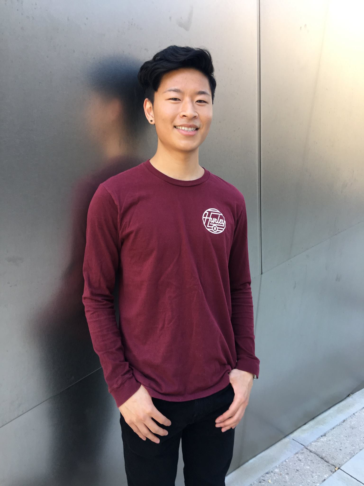

	

			
	

# *A little about me*

Hi! My name is Kenny and I studied at University of California, Los Angeles. I graduated June 2018 with a B.S. in Neuroscience with a minor in Statistics.
   

<!-- If you had asked me five years ago what my career goals were, I would have told you that I had my eyes set on becoming a medical doctor. Oh, how naïve I was back then. Although I find neuroscience and the brain exceptionally fascinating, I can no longer see myself pursuing a career in medicine because I can't say it's where my passion lies. I must say, however, that it was through this facet of neuroscience and research that led me to discover something I'm truly passionate about - <i>data</i>.    

To me, data, or more specifically, machine learning is... almost like a super power. It allows us to consume data from the past to predict the future, often times with amazing results.   

From microscopic biological neurons to massive artificial neural networks with billions of paramters, I think I've found my calling. Indeed, 
  

Perhaps it was the study of biological neurons and neural networks that piqued my recent interest in learning more about the silicon model of the brain (artificial neural networks).  -->

   
  

  
