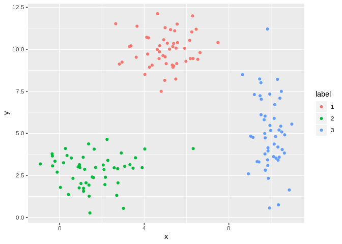

**Introduction to K-Means Clustering**
======================================

<em>Kenny Lov</em>  

First, let's used a contrived *toy* example to better understand this
topic. k-means clustering works better if the clusters are spherical and
normally distributed. For this example, we'll create a small, arbitrary
dataset with 5 different clusters (5 populations with different means
and variances).

    # first create individual clusters with different distribution parameters
    x1 <- rnorm(50, mean = 5, sd = 1)
    y1 <- rnorm(50, mean = 10, sd = 1)
    df1 <- data.frame(x = x1, y = y1, label = 1)

    x2 <- rnorm(50, mean = 1.5, sd = 1.5)
    y2 <- rnorm(50, mean = 3, sd = 1)
    df2 <- data.frame(x = x2, y = y2, label = 2)

    x3 <- rnorm(50, mean = 10, sd = 0.5)
    y3 <- rnorm(50, mean = 5, sd = 2)
    df3 <- data.frame(x = x3, y = y3, label = 3)

    combined <- rbind(df1, df2, df3)
    combined$label <- as.factor(combined$label)

Now that we've created this *toy* dataset, let's visualize it and
confirm that we've indeed created distinct clusters.

    library(ggplot2)

    g <- ggplot(combined, aes(x= x, y = y)) +
      geom_point(aes(color=label)) 
    # note that label needs to be converted into a factor since otherwise ggplot will interpret it as a continuous variable when it really isn't!

    g

Yes, there are indeed distinct clusters!

Now, since this is a *boring* example, let 's use a more interesting
dataset!
