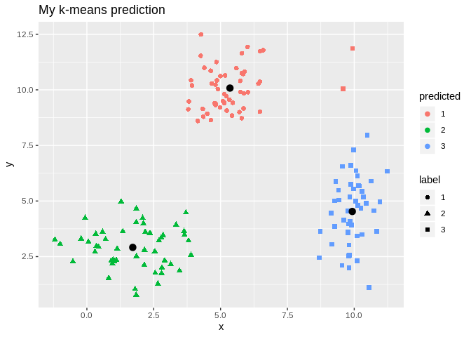

**Introduction to K-Means Clustering**
======================================

<p style="text-align:center;">
<em>Kenny Lov</em><br><br>
</p>
First, let's used a contrived *toy* example to better understand this topic. k-means clustering works better if the clusters are spherical and normally distributed. For this example, we'll create a small, arbitrary dataset with 5 different clusters (5 populations with different means and variances).

``` r
# first create individual clusters with different distribution parameters
x1 <- rnorm(50, mean = 5, sd = 1)
y1 <- rnorm(50, mean = 10, sd = 1)
df1 <- data.frame(x = x1, y = y1, label = 1)

x2 <- rnorm(50, mean = 1.5, sd = 1.5)
y2 <- rnorm(50, mean = 3, sd = 1)
df2 <- data.frame(x = x2, y = y2, label = 2)

x3 <- rnorm(50, mean = 10, sd = 0.5)
y3 <- rnorm(50, mean = 5, sd = 2)
df3 <- data.frame(x = x3, y = y3, label = 3)

combined <- rbind(df1, df2, df3)
combined$label <- as.factor(combined$label)
```

Now that we've created this *toy* dataset, let's visualize it and confirm that we've indeed created distinct clusters.

``` r
library(ggplot2)

g <- ggplot(combined, aes(x= x, y = y)) +
  geom_point(aes(color=label), size = 2) +
  labs(title = "Toy Example")
# note that label needs to be converted into a factor since otherwise ggplot will interpret it as a continuous variable when it really isn't!
g
```


Yes, there are indeed distinct clusters! R already comes with a great built-in function `kmeans` that can compute clusters. However, for the sake of understanding, we'll hand-code a function that can also compute clusters.

``` r
no_labs = combined[,1:2]

my_kmeans <- function(df, n_clusters){ # the function will take a dataframe and num clusters as input
  # first, get the range of possible values to initiate random centers
  
  Z_hist <- data.frame()          # create history of Z and centers to see                                                                    progress of iterations
  C_hist <- data.frame()
  
  Z <- rep(-1, nrow(df))     # Z are our indicator variable, we need to set placeholders for these                                     variables that are different values. values don't matter as long as they                                are different from each other
  Z_new <- rep(0, nrow(df))  # these variables will tell the algorithm when to stop iterations
  
  centers <- array(0, dim = c(n_clusters, ncol(df)) ) # create a placeholder for centers array
  # now we can initialize random centers

  min <- min(df[,1])
  max <- max(df[,2])  
  for(row in seq(1, n_clusters)){
    for(col in seq(1, dim(centers)[2] ))
      centers[row, col] <- runif(1, min, max)
  }

  # means = colMeans(df)
  # for(row in seq(1, n_clusters)){
  #   for(col in seq(1, dim(centers)[2])){
  #     centers[row, col] = means[col] + rnorm(1)
  #   }
  # }
  
  # now that we have the centers, we need to find differences between each point from each cluster
  # we will create a distance matrix
  
  Dist <- array(0, dim = c(nrow(df), n_clusters ) )
  
  iteration = 0 # keep track of iterations
  while(sum(Z-Z_new) !=0 ){ # keep iterating until Z and Z_new are equal
    
    Z_add <- data.frame(Z = Z_new, iteration = iteration)
    C_add <- data.frame(centers, iteration = iteration)
    
    Z_hist <- rbind(Z_hist, Z_add)
    C_hist <- rbind(C_hist, C_add)
    
    
    Z <- Z_new
    for(center in seq(1, nrow(centers))){
      distance <- apply(df, 1, function(x) sum((x - centers[center, ])^2) )
      for(x in seq(1, length(distance))){
        Dist[x, center] <- distance[x]
      }
    }
    Z_new <- max.col(-Dist) # note that max.col function finds the column that has the maximum value.
                            # since we want to find the minimum distance, we invert by distance matrix
                            # by multiplying the whole matrix by -1. 
    
    # next, we need to move the centers since the center values for each cluster has changed
    
    for(center in seq(1, n_clusters)){
      for(var in seq(1, ncol(centers) )){
        if(sum(Z_new==center) ==0 ) centers[center, var] = centers[center, var]
        else centers[center, var] <- mean(df[Z_new == center, var])
      }
    }

    iteration = iteration + 1
  }
  cat('Took', iteration - 1, 'iterations to converge!')
  Z_hist$Z <- as.factor(Z_hist$Z)
  output <- list(Z_new, centers, Z_hist, C_hist)
  return(output)
}
```

Might not be the most efficient code possible with all the for loops and what not... but let's see what it can do.

Since this is an iterative approach, we can visualize the progress at every iteration using the history variables provided by my function!

``` r
library(gganimate)
prediction <- my_kmeans(no_labs, 3)
```

    ## Took 2 iterations to converge!

``` r
Z_hist <- cbind(combined, prediction[[3]])
c_hist <- prediction[[4]]

g <- ggplot(Z_hist, aes(x = x, y = y)) +
  geom_point(aes(color = Z, shape = label), size = 2) +
  geom_point(data = c_hist, aes(x = X1, y = X2), size = 3) +
  labs(title = 'Iteration {frame_time}') +
  transition_time(iteration)

animate(g, nframes=  length(unique(Z_hist$iteration)), fps = 1)
```


``` r
#anim_save('clustering1.gif')
```

Final Result:

``` r
combined$predicted <- as.factor(prediction[[1]]) # remeber to convert the integer values to                                                                 factors
centers <- prediction[[2]]

g <- ggplot(combined, aes(x = x, y = y)) + 
  geom_point(aes(color = predicted, shape = label), size = 2) +
  geom_point(data = data.frame(centers), aes(X1, X2), size = 3) +
  labs(title = 'My k-means prediction')
  
g
```



Since in this case our labels are known, we can caclulate the confusion matrix for the prediction of this algorithm.

Now, since this is a *boring* example, let's use a more interesting dataset!
