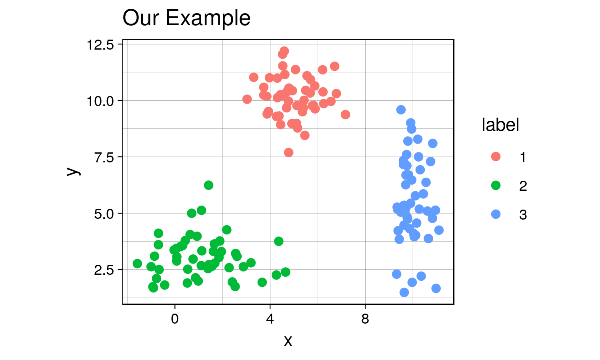
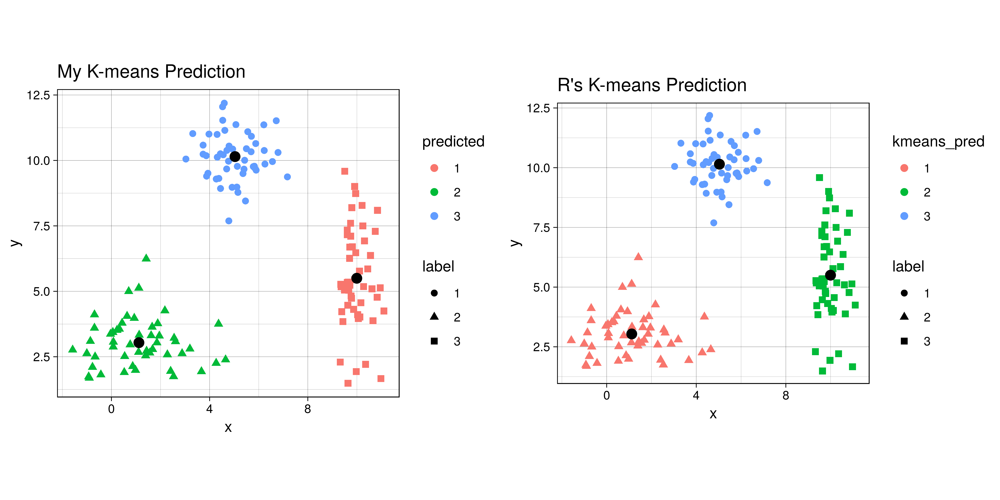
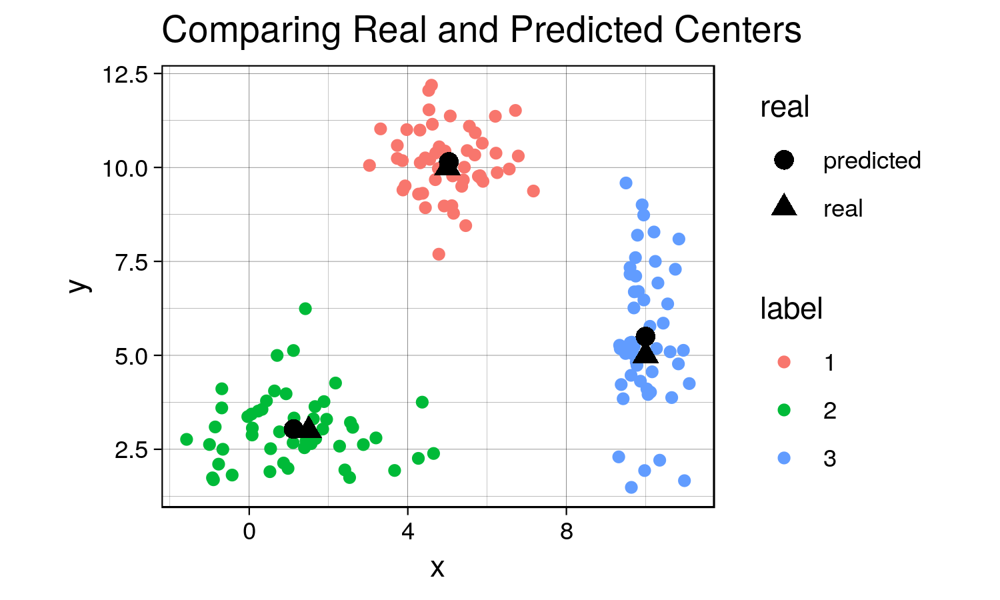
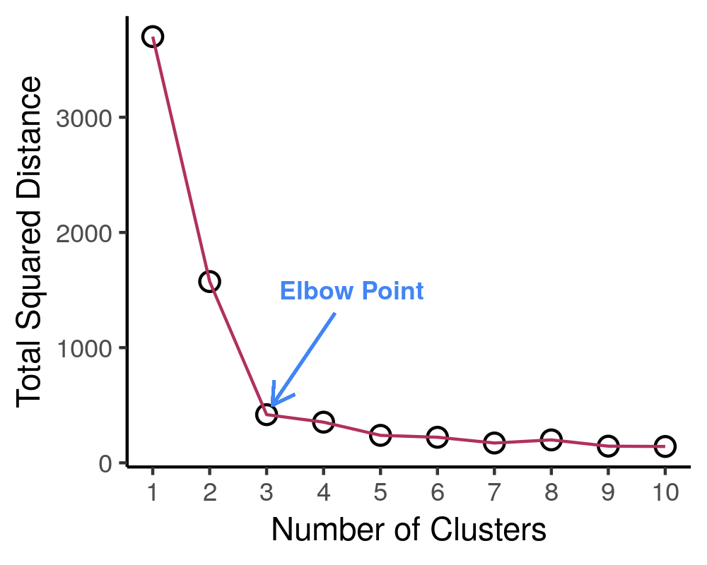

**Introduction to K-Means Clustering (IN PROGRESS)**
====================================================

<link rel="stylesheet" type="text/css" href="/projects/kmeans_intro/kmeans.css">
<p style="text-align:center;">
<em>Kenny Lov</em><br><br>
</p>
First, let’s used a contrived *toy* example to better understand this
topic. k-means clustering works better if the clusters are spherical and
normally distributed. For this example, we’ll create a small, arbitrary
dataset with 5 different clusters (5 populations with different means
and variances).

``` r
# first create individual clusters with different distribution parameters
set.seed(123) # setting a seed for reproducibility

x1 <- rnorm(50, mean = 5, sd = 1)
y1 <- rnorm(50, mean = 10, sd = 1)
df1 <- data.frame(x = x1, y = y1, label = 1)

x2 <- rnorm(50, mean = 1.5, sd = 1.5)
y2 <- rnorm(50, mean = 3, sd = 1)
df2 <- data.frame(x = x2, y = y2, label = 2)

x3 <- rnorm(50, mean = 10, sd = 0.5)
y3 <- rnorm(50, mean = 5, sd = 2)
df3 <- data.frame(x = x3, y = y3, label = 3)

combined <- rbind(df1, df2, df3)
combined$label <- as.factor(combined$label) # label must be converted into a factor since it will be interpreted as a continuous variable, which it is not.
```

Now that we’ve created this *toy* dataset, let’s visualize it and
confirm that we’ve indeed created distinct clusters.

``` r
library(ggplot2)
th <- theme_linedraw() # setting the theme for the plots
tiff('./images/plot1.tiff', units="in", width=5, height=3, res=300)

ggplot(combined, aes(x= x, y = y)) +
  geom_point(aes(color=label), size = 2) +
  labs(title = "Toy Example") + 
  th + theme(aspect.ratio = 0.8) 

garb <- dev.off()
```



Yes, there are indeed distinct clusters with various normal
distributions! R already comes with a great built-in function `kmeans`
that can compute clusters. However, for the sake of understanding, we’ll
hand-code a function that can compute the clusters as well as keep track
of the data for each iteration to visualize the progress of the
algorithm. If this sounds confusing now, it will make sense in a bit.

``` r
my_kmeans <- function(df, n_clusters){ # the function will take a dataframe and num clusters as input
  # first, get the range of possible values to initiate random centers
  
  Z_hist <- data.frame()          # create history of Z and centers to see progress of iterations
  C_hist <- data.frame()
  
  Z <- rep(-1, nrow(df))     # Z are our indicator variable, we need to set placeholders for these variables that are different values. values don't matter as long as they are different from each other
 
   Z_new <- rep(0, nrow(df))  # these variables will tell the algorithm when to stop iterations
  
  centers <- array(0, dim = c(n_clusters, ncol(df)) ) # create a placeholder for centers array
  # now we can initialize random centers

  min <- min(df[,1])
  max <- max(df[,2])  
  for(row in seq(1, n_clusters)){
    for(col in seq(1, dim(centers)[2] ))
      centers[row, col] <- runif(1, min, max)
  }
  
  # now that we have the centers, we need to find differences between each point from each cluster
  # we will create a distance matrix
  
  Dist <- array(0, dim = c(nrow(df), n_clusters ) )
  
  iteration = 0 # keep track of iterations
  while(sum(Z-Z_new) !=0 ){ # keep iterating until Z and Z_new are equal
    
    Z_add <- data.frame(Z = Z_new, iteration = iteration)
    C_add <- data.frame(centers, iteration = iteration)
    
    Z_hist <- rbind(Z_hist, Z_add) # appending new iterations to keep track of the history
    C_hist <- rbind(C_hist, C_add)
    
    Z <- Z_new
    for(center in seq(1, nrow(centers))){
      distance <- apply(df, 1, function(x) sum((x - centers[center, ])^2) ) # compute euclidian distance 
      for(x in seq(1, length(distance))){
        Dist[x, center] <- distance[x] # filling in distance matrix with euclidian distances
      }
    }
    
    Z_new <- max.col(-Dist) # note that max.col function finds the column that has the maximum value.
                            # since we want to find the minimum distance, we invert by distance matrix
                            # by multiplying the whole matrix by -1. 
    
    # next, we need to move the centers since the center values for each cluster has changed
    
    for(center in seq(1, n_clusters)){
      for(var in seq(1, ncol(centers) )){
        if(sum(Z_new==center) ==0 ) centers[center, var] = centers[center, var]
        else centers[center, var] <- mean(df[Z_new == center, var])
      }
    }

    iteration = iteration + 1
  }
  # cat('Took', iteration - 1, 'iterations to converge!')
  Z_hist$prediction <- as.factor(Z_hist$Z)
  Z_new <- as.factor(Z_new)
  output <- list(Z_new, centers, Z_hist, C_hist)
  return(output)
}
```

Might not be the most efficient code possible with all the for loops and
what not… but let’s see what it can do.

Since this is an iterative approach, we can visualize the progress at
every iteration using the history variables provided by my function!

``` r
library(gganimate)

no_labs = combined[,1:2]

prediction <- my_kmeans(no_labs, 3)
Z_hist <- cbind(combined, prediction[[3]])
c_hist <- prediction[[4]]

g <- ggplot(Z_hist, aes(x = x, y = y)) +
  geom_point(aes(color = prediction, shape = label), size = 1) +
  geom_point(data = c_hist, aes(x = X1, y = X2), size = 2) +
  labs(title = 'Iteration: {frame_time}') +
  th + theme(text = element_text(size = 5)) +
  transition_time(iteration) 

animate(g, nframes=  length(unique(Z_hist$iteration)), fps = 1,
        width = 1000, height=800, res = 300)
```


This animation essentially shows each step the algorithm takes to make
its decision of which points are closest to each centroid. As you can
see, the centroids (black dots) move around the grid and each color
represents which centroid/cluster the individual samples are currently
part of. The shape of each point represents the real group the point
came from. We can see that the algorithm does a really good job in
finding the centers for each group that we manually created, although
there are some that are wrongly grouped.

Final Result (as a sanity check, let’s compare with R’s built in
`kmeans` function):

``` r
combined$predicted <- as.factor(prediction[[1]]) # remeber to convert the integer values to  factors
centers <- prediction[[2]]

kmeans <- kmeans(no_labs, 3)

combined$kmeans_pred <- as.factor(kmeans$cluster)

g1 <- ggplot(combined, aes(x = x, y = y)) + 
  geom_point(aes(color = predicted, shape = label), size = 2) +
  geom_point(data = data.frame(centers), aes(X1, X2), size = 3) +
  labs(title = 'My K-means Prediction') +
  th + theme(aspect.ratio = 0.9)

g2 <- ggplot(combined, aes(x=x , y = y)) +
  geom_point(aes(color = kmeans_pred, shape = label), size = 2) +
  geom_point(data = data.frame(data.frame(kmeans$centers)), aes(x, y), size = 3) +
  labs(title = "R's K-means Prediction") +
  th + theme(aspect.ratio = 0.9)

library(gridExtra) # import library to display graphs in a grid

tiff('./images/plot2.tiff', units="in", width=10, height=5, res=600)

grid.arrange(g1, g2, nrow=1, respect=TRUE)

garb <- dev.off()
```



The difference in colors between the two graphs is simply an artifact of
the random initialization of the centroids. Even though some clusters
are different colors, the points are actually clustered the same in both
`my_kmeans` and R’s `kmeans`. So it work!

Now let’s compare the centers that the algorithm found to the actual
centers that we created.

``` r
predicted_centers <- tail(c_hist, 3)[,-3] # k-means predicted centers
predicted_centers$real <- 'predicted'

real_centers <- matrix(c(5,10,1.5,3,10,5), byrow = TRUE, ncol=2) # generated data from these centers
real_centers <- data.frame(real_centers)
real_centers$real <- 'real'

both_centers <- rbind(predicted_centers, real_centers)

tiff('./images/plot3.tiff', units="in", width=5, height=3, res=300)
 
ggplot(combined, aes(x = x, y = y)) +
  geom_point(aes(color = label)) +
  geom_point(data = both_centers, aes(x= X1,y= X2, shape = real), size = 3) +
  labs(title = 'Comparing Real and Predicted Centers') +
  th + theme(aspect.ratio = 0.8)

garb <- dev.off()
```



Although the predicted cluster centers are not perfectly on top of the
real centers (due to the random nature of the sampling), they are very
close to each other, showing that the algorithm does work when there are
distinct clusters!

Since in this case our labels are known, we can caclulate the confusion
matrix for the prediction of this algorithm.

Now… you might be wondering *how do I determine the number of
clusters?!* Well, there are multiple ways of doing so. In our case, we
decided on three clusters because we knew ahead of time that there would
be three clustered, since we generated the data. Here are some ways I
can think of:

1.  Domain knowledge. Ideally, you should be familiar with the data
    you’re working with and should have a sense of the number of
    clusters in your data.
2.  Create a scree plot. Plot the number of clusters against the total
    squared distance of each point from its respective centroid. Let’s
    see an example of this.

``` r
# first create function to determine total distance from clusters
# pass in the data (raw data), the predicted labels from k means, and the centers
find_distances <- function(data, predicted_labs, centers){
  # first prepare dataframes for computations
  merged <- cbind(data, center = predicted_labs) # combining the raw data with the predicted labs
  # center_lab <- data.frame(centers, center = 1:nrow(centers))
  #merged2 <- merge(merged1, center_lab)
  tot_sq_dist <- 0 # initialize total square distacnce
  
  for(cen in 1:nrow(centers)){
    cluster_points <- merged[merged$center==cen,  colnames(merged) != 'center']
    if(nrow(cluster_points)!=0){
      expand_centers <- matrix(rep(centers[cen,], nrow(cluster_points)), ncol = 2, byrow=TRUE)
      sq_dist <- sum((cluster_points - expand_centers)^2)
      tot_sq_dist <- tot_sq_dist + sq_dist
    }
  }
  return(tot_sq_dist)  
}

km <- my_kmeans(no_labs, 4)
predicted_labs <- km[[1]]
centers <- km[[2]]
find_distances(no_labs, predicted_labs, centers)
```

    ## [1] 385.0495

Great, now let’s see how we can use a scree plot to our advantage!

``` r
lab_hist <- data.frame() # initialize histories
cen_hist <- data.frame()
dist_hist <- data.frame()

num_clusters <- 10
for(clusters in 1:num_clusters){
  km <- my_kmeans(no_labs, n_clusters = clusters)
  
  new_df <- no_labs
  new_df$pred <- km[[1]]
  new_df$num_clusters <- clusters
  
  centers <- data.frame(km[[2]])
  centers$num_clusters <- clusters
  
  lab_hist <- rbind(lab_hist, new_df)
  cen_hist <- rbind(cen_hist, centers)
  
  sq_dist <- find_distances(no_labs, new_df$pred,
                                    as.matrix(centers[,colnames(centers) != 'num_clusters']))
  sq_dist_df <- data.frame(sq_dist, num_clusters = clusters)
  dist_hist <- rbind(dist_hist, sq_dist_df)
}

tiff('./images/scree.tiff', units="px", width=1000, height=800, res=300)

ggplot(dist_hist, aes(x = num_clusters, y = sq_dist)) +
  geom_point() +
  geom_point(color = 'white', size = 1) +
  geom_line(color = 'maroon') +
  xlab('Number of Clusters') + ylab('Total Squared Distance') +
  scale_x_continuous(breaks = 0:num_clusters+1) + theme_classic()
  
garb <- dev.off()

# create the gif
g <- ggplot(lab_hist, aes(x,y)) +
  geom_point(aes(color = pred)) +
  geom_point(data = cen_hist, aes(X1, X2)) +
  labs(title = 'Number of Clusters: {frame_time}') +
  th + theme(text = element_text(size = 8), legend.position = 'none') +
  transition_time(num_clusters) 
  
animate(g, nframes =  num_clusters, fps = 1,
        width = 1000, height=800, res = 300)
```


|    Cluster \# Effect on Sq. Dist   |       Scree Plot      |
|:----------------------------------:|:---------------------:|
|  |  |

Now, since this is a *boring* example, let’s use a more interesting
dataset!
