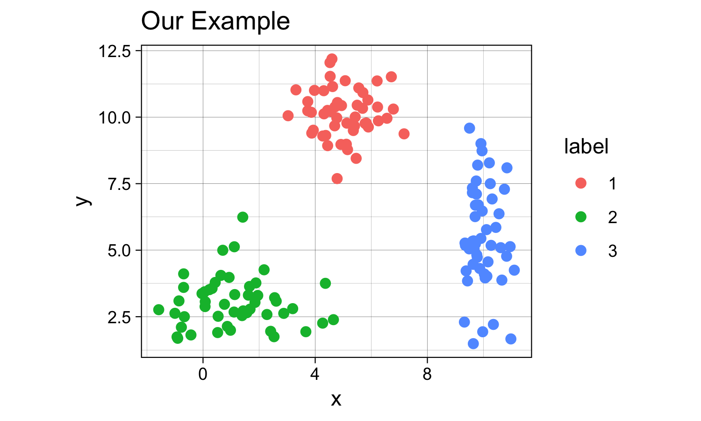
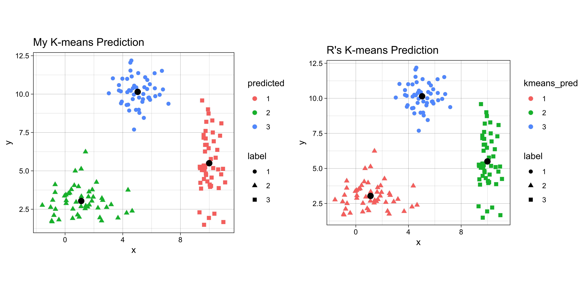
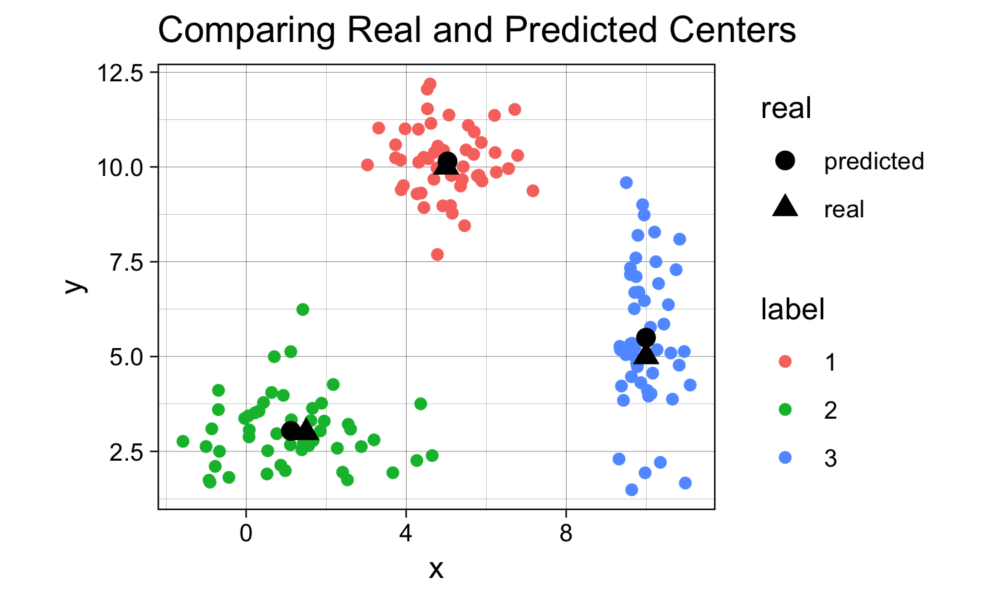
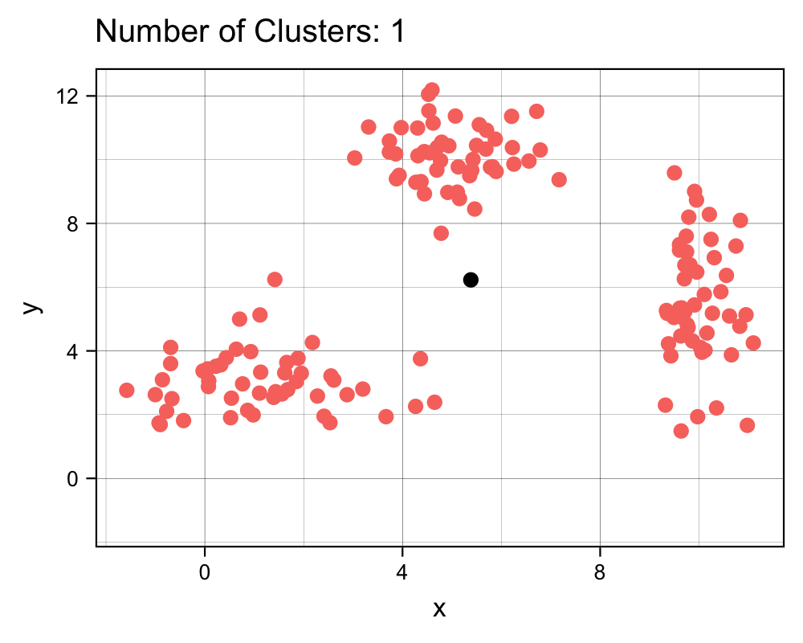
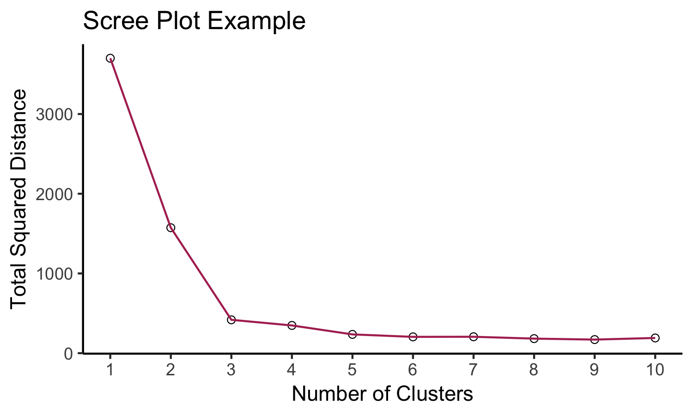
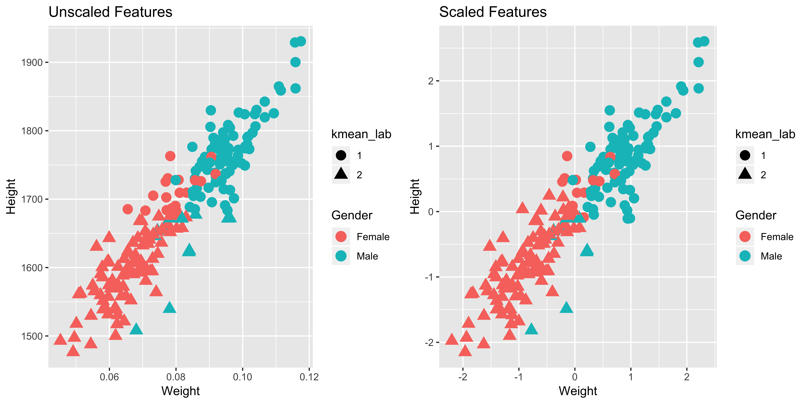

```{r, echo = F}
knitr::opts_chunk$set(
  fig.path = "images/"
)
```

# __Introduction to K-Means Clustering (IN PROGRESS)__

<link rel="stylesheet" type="text/css" href="/projects/kmeans_intro/kmeans.css">
<p style = 'text-align:center;'>
<em>Kenny Lov</em><br><br>
</p>

<p>

<i>K-Means clustering</i> is a machine learning algorithm that falls under the category of unsupervised learning. Unsupervised learning techniques are used when there is a set of features  \(X\) without an associated label or response \(Y\) and thus the aim is not for prediction, but rather to uncover new and perhaps interesting trends and subgroups within the data. Unsupervised learning is often used as part of <i>exploratory data analysis</i> and can aid in visualizations. The main goal of <i>K-Means</i> is to partition the observations into \(K\) distinct groups such that the observations in one group or cluster are as similar to each other as possible while also being as different as possible from the observations from other groups. So, how exactly is <i>similarity</i> measured? By Euclidian distance based on an observation's numerical features. Here's a breakdown of the steps of <i>K-Means</i>: 

</p>

<ol>
  <li>Scale the data since Euclidian distances will be involved</li>
  <li>Select \(K\) number of clusters believed to exist in the data</li>
  <li>Randomly initialize the centroids</li>
  <li>Calculate distances between samples and each centroid</li>
  <li>Assign the samples into the cluster whose centroid they are closest to</li>  
  <li>Recalculate cluster centers based on these newly assigned samples</li>
  <li>Repeat from step 4 until cluster centers no longer shift (when samples no longer get reassigned to a different centroid)</li>
</ol>

Completion of the algorithm yields:

<ul>
  <li>A vector of labels that corresponds to which group or cluster an observation belongs to</li>
  <li>The location in the feature space for each of the cluster centroids</li>
</ul>


## Table of Contents
1. [Use Cases](#use-cases)
2. [The Algorithm](#the-algorithm)
3. [Selecting K ](#selecting-k)
4. [Applications](#applications)


## Use Cases


## The Algorithm

<p>
This is the function the algorithm aims to minimize:
$$\min_{C_1,...,C_K}\sum^{K}_{k=1}W(C_k)$$
Where:
$$W(C_k) = \frac{1}{|C_k|} \sum^{}_{i, i' \in C_k}\sum^{p}_{j=1}(x_{ij}-x_{i'j})^2$$

Looks complicated, but all it really means is that we want to divide up the observations into \(K\) clusters such that the total variation within each cluster is as small as possible. The within cluster distances will be defined with euclidian distance. Therefore the total within cluster <i>variation</i> is defined by within cluster distances divided by the number of observations per cluster \(C_k\).

</p> <br><hr><br>


First, let's used a contrived *toy* example to better understand this topic.
k-means clustering works better if the clusters are spherical and normally distributed.
For this example, we'll create a small, arbitrary dataset with 5 different clusters (5 populations with different means and variances).

```{r}
# first create individual clusters with different distribution parameters
set.seed(123) # setting a seed for reproducibility

x1 <- rnorm(50, mean = 5, sd = 1)
y1 <- rnorm(50, mean = 10, sd = 1)
df1 <- data.frame(x = x1, y = y1, label = 1)

x2 <- rnorm(50, mean = 1.5, sd = 1.5)
y2 <- rnorm(50, mean = 3, sd = 1)
df2 <- data.frame(x = x2, y = y2, label = 2)

x3 <- rnorm(50, mean = 10, sd = 0.5)
y3 <- rnorm(50, mean = 5, sd = 2)
df3 <- data.frame(x = x3, y = y3, label = 3)

combined <- rbind(df1, df2, df3)
combined$label <- as.factor(combined$label) # label must be converted into a factor since it will be interpreted as a continuous variable, which it is not.
```

Now that we've created this *toy* dataset, let's visualize it and confirm that we've indeed created distinct clusters.

```{r}
library(ggplot2)
th <- theme_linedraw() # setting the theme for the plots
tiff('./images/plot1.tiff', units="in", width=5, height=3, res=300)

ggplot(combined, aes(x= x, y = y)) +
  geom_point(aes(color=label), size = 2) +
  labs(title = "Our Example") + 
  th + theme(aspect.ratio = 0.8) 

garb <- dev.off()
```

```{r, echo = FALSE, eval = FALSE}
colors = c('red', 'orange', 'purple')
g <- ggplot(combined, aes(x= x, y = y)) +
  geom_point(aes(color=label), size = 8) +
  theme_void() + theme(aspect.ratio = 0.8, legend.position='none') +
  stat_ellipse(aes(x=x, y=y,color=label, group=label),type = "norm", size = 4) +
  scale_color_manual(values=colors)
g 

ggsave(g, filename = "../img/k_means_icon.png",  bg = "transparent")
```




Yes, there are indeed distinct clusters with various normal distributions! R already comes with a great built-in function `kmeans` that can compute clusters. However, for the sake of understanding, we'll hand-code a function that can compute the clusters as well as keep track of the data for each iteration to visualize the progress of the algorithm. If this sounds confusing now, it will make sense in a bit.


```{r my_kmeans func}
my_kmeans <- function(df, n_clusters){ # the function will take a dataframe and num clusters as input
  # first, get the range of possible values to initiate random centers
  
  Z_hist <- data.frame()          # create history of Z and centers to see progress of iterations
  C_hist <- data.frame()
  
  Z <- rep(-1, nrow(df))     # Z are our indicator variable, we need to set placeholders for these variables that are different values. values don't matter as long as they are different from each other
 
   Z_new <- rep(0, nrow(df))  # these variables will tell the algorithm when to stop iterations
  
  centers <- array(0, dim = c(n_clusters, ncol(df)) ) # create a placeholder for centers array
  # now we can initialize random centers

  min <- min(df)
  max <- max(df)  
  for(row in seq(1, n_clusters)){
    for(col in seq(1, dim(centers)[2] ))
      centers[row, col] <- runif(1, min, max)
  }
  
  # now that we have the centers, we need to find differences between each point from each cluster
  # we will create a distance matrix
  
  Dist <- array(0, dim = c(nrow(df), n_clusters ) )
  
  iteration = 0 # keep track of iterations
  while(sum(Z-Z_new) !=0 ){ # keep iterating until Z and Z_new are equal
    
    Z_add <- data.frame(Z = Z_new, iteration = iteration)
    C_add <- data.frame(centers, iteration = iteration)
    
    Z_hist <- rbind(Z_hist, Z_add) # appending new iterations to keep track of the history
    C_hist <- rbind(C_hist, C_add)
    
    Z <- Z_new
    for(center in seq(1, nrow(centers))){
      distance <- apply(df, 1, function(x) sum((x - centers[center, ])^2) ) # compute euclidian distance 
      for(x in seq(1, length(distance))){
        Dist[x, center] <- distance[x] # filling in distance matrix with euclidian distances
      }
    }
    
    Z_new <- max.col(-Dist) # note that max.col function finds the column that has the maximum value.
                            # since we want to find the minimum distance, we invert by distance matrix
                            # by multiplying the whole matrix by -1. 
    
    # next, we need to move the centers since the center values for each cluster has changed
    
    for(center in seq(1, n_clusters)){
      for(var in seq(1, ncol(centers) )){
        if(sum(Z_new==center) ==0 ) centers[center, var] = centers[center, var]
        else centers[center, var] <- mean(df[Z_new == center, var])
      }
    }

    iteration = iteration + 1
  }
  # cat('Took', iteration - 1, 'iterations to converge!')
  Z_hist$prediction <- as.factor(Z_hist$Z)
  Z_new <- as.factor(Z_new)
  output <- list(Z_new, centers, Z_hist, C_hist)
  return(output)
}

```

Might not be the most efficient code possible with all the for loops and what not... but let's see what it can do.

Since this is an iterative approach, we can visualize the progress at every iteration using the history variables provided by my function!


```{r}
library(gganimate)

no_labs = combined[,1:2]

prediction <- my_kmeans(no_labs, 3)
Z_hist <- cbind(combined, prediction[[3]])
c_hist <- prediction[[4]]

g <- ggplot(Z_hist, aes(x = x, y = y)) +
  geom_point(aes(color = prediction, shape = label), size = 1) +
  geom_point(data = c_hist, aes(x = X1, y = X2), size = 2) +
  labs(title = 'Iteration: {frame_time}') +
  th + theme(text = element_text(size = 5)) +
  transition_time(iteration) 

animate(g, nframes=  length(unique(Z_hist$iteration)), fps = 1,
        width = 1000, height=800, res = 300)
```


This animation essentially shows each step the algorithm takes to make its decision of which points are closest to each centroid. Iteration 0 is the initial randomization of the centroids (black dots). As you can see, the centroids move around the grid and each color represents which centroid/cluster the individual samples are currently part of. The shape of each point represents the real group the point came from. We can see that the algorithm does a really good job in finding the centers for each group that we manually created, although there are some that are wrongly grouped. 

Final Result (as a sanity check, let's compare with R's built in `kmeans` function):

```{r}
combined$predicted <- as.factor(prediction[[1]]) # remeber to convert the integer values to  factors
centers <- prediction[[2]]

kmeans <- kmeans(no_labs, 3)

combined$kmeans_pred <- as.factor(kmeans$cluster)

g1 <- ggplot(combined, aes(x = x, y = y)) + 
  geom_point(aes(color = predicted, shape = label), size = 2) +
  geom_point(data = data.frame(centers), aes(X1, X2), size = 3) +
  labs(title = 'My K-means Prediction') +
  th + theme(aspect.ratio = 0.9)

g2 <- ggplot(combined, aes(x=x , y = y)) +
  geom_point(aes(color = kmeans_pred, shape = label), size = 2) +
  geom_point(data = data.frame(data.frame(kmeans$centers)), aes(x, y), size = 3) +
  labs(title = "R's K-means Prediction") +
  th + theme(aspect.ratio = 0.9)

library(gridExtra) # import library to display graphs in a grid

tiff('./images/plot2.tiff', units="in", width=10, height=5, res=600)

grid.arrange(g1, g2, nrow=1, respect=TRUE)

garb <- dev.off()
```



The difference in colors between the two graphs is simply an artifact of the random initialization of the centroids. Even though some clusters are different colors, the points are actually clustered the same in both `my_kmeans` and R's `kmeans`. So it works!


Now let's compare the centers that the algorithm found to the actual centers that we created.

```{r}
predicted_centers <- tail(c_hist, 3)[,-3] # k-means predicted centers
predicted_centers$real <- 'predicted'

real_centers <- matrix(c(5,10,1.5,3,10,5), byrow = TRUE, ncol=2) # generated data from these centers
real_centers <- data.frame(real_centers)
real_centers$real <- 'real'

both_centers <- rbind(predicted_centers, real_centers)

tiff('./images/plot3.tiff', units="in", width=5, height=3, res=300)
 
ggplot(combined, aes(x = x, y = y)) +
  geom_point(aes(color = label)) +
  geom_point(data = both_centers, aes(x= X1,y= X2, shape = real), size = 3) +
  labs(title = 'Comparing Real and Predicted Centers') +
  th + theme(aspect.ratio = 0.8)

garb <- dev.off()
```



Although the predicted cluster centers are not perfectly on top of the real centers (due to the random nature of the sampling), they are very close to each other, demonstrating that the algorithm does work when there are distinct clusters!  


Since in this case our labels are known, we can caclulate the confusion matrix for the prediction of this algorithm.

```{r}

```

## Selecting K

Now... you might be wondering *how do I determine the number of clusters?!* Well, there are multiple ways of doing so. In our case, we decided on three clusters because we knew ahead of time that there would be three clustered, since we generated the data. Here are some ways I can think of:

1. Domain knowledge. Ideally, you should be familiar with the data you're working with and should have a sense of the number of clusters in your data.
2. Create a scree plot. Plot the number of clusters against the total within sum of squares distance of each point from its respective centroid. Let's see an example of this.


```{r}
# first create function to determine total distance from clusters
# pass in the data (raw data), the predicted labels from k means, and the centers
find_distances <- function(data, predicted_labs, centers){
  # first prepare dataframes for computations
  merged <- cbind(data, center = predicted_labs) # combining the raw data with the predicted labs
  # center_lab <- data.frame(centers, center = 1:nrow(centers))
  #merged2 <- merge(merged1, center_lab)
  tot_sq_dist <- 0 # initialize total square distacnce
  
  # following lines add up the total squared distances
  for(cen in 1:nrow(centers)){
    cluster_points <- merged[merged$center==cen,  colnames(merged) != 'center']
    if(nrow(cluster_points)!=0){
      expand_centers <- matrix(rep(centers[cen,], nrow(cluster_points)), ncol = 2, byrow=TRUE)
      sq_dist <- sum((cluster_points - expand_centers)^2)
      tot_sq_dist <- tot_sq_dist + sq_dist
    }
  }
  return(tot_sq_dist)  
}

# testing function ...
# km <- my_kmeans(no_labs, 4)
# predicted_labs <- km[[1]]
# centers <- km[[2]]
# find_distances(no_labs, predicted_labs, centers)
```

Great, now let's see how we can use a scree plot to our advantage!

```{r scree}
lab_hist <- data.frame() # initialize histories
cen_hist <- data.frame()
dist_hist <- data.frame()

num_clusters <- 10
for(clusters in 1:num_clusters){
  km <- my_kmeans(no_labs, n_clusters = clusters)
  
  new_df <- no_labs
  new_df$pred <- km[[1]]
  new_df$num_clusters <- clusters
  
  centers <- data.frame(km[[2]])
  centers$num_clusters <- clusters
  
  lab_hist <- rbind(lab_hist, new_df)
  cen_hist <- rbind(cen_hist, centers)
  
  sq_dist <- find_distances(no_labs, new_df$pred,
                                    as.matrix(centers[,colnames(centers) != 'num_clusters']))
  sq_dist_df <- data.frame(sq_dist, num_clusters = clusters)
  dist_hist <- rbind(dist_hist, sq_dist_df)
}

tiff('./images/scree.tiff', units="px", width=1000, height=800, res=300)

ggplot(dist_hist, aes(x = num_clusters, y = sq_dist)) +
  geom_point(size=3) +
  geom_point(color = 'white', size = 2) +
  geom_line(color = 'maroon', size= 0.5) +
  xlab('Number of Clusters') + ylab('Total Squared Distance') +
  scale_x_continuous(breaks = 0:num_clusters+1) + theme_classic() +
  annotate("text", x = 4.5, y = 1500, label = "Elbow Point", size = 3, fontface=2,
           colour = '#4285f4') +
  geom_segment(aes(x=4.2, y=1300, xend = 3.1, yend = 500), arrow = arrow(length=unit(0.3, 'cm')),
               colour = '#4285f4')
  
garb <- dev.off()

# create the gif
g <- ggplot(lab_hist, aes(x,y)) +
  geom_point(aes(color = pred)) +
  geom_point(data = cen_hist, aes(X1, X2), size=3) +
  labs(title = 'Number of Clusters: {frame_time}') +
  th + theme(text = element_text(size = 8), legend.position = 'none') +
  transition_time(num_clusters) 
  
animate(g, nframes =  num_clusters, fps = 1,
        width = 1000, height=800, res = 300)
```

Cluster # Effect on Sq. Dist             |  Scree Plot
:-------------------------:|:-------------------------:
   | 

```{r eval=FALSE, include=FALSE}
# create the second gif
# anim_dist_hist <- data.frame() # just for fun, animation :)
# for(i in 1:nrow(dist_hist)){
#   ph <- dist_hist[dist_hist$num_clusters <= i,]
#   ph$frame <- i
#   anim_dist_hist <- rbind(anim_dist_hist, ph)
# }
# 
# g2 <- ggplot(anim_dist_hist, aes(x = as.integer(num_clusters), y = sq_dist)) +
#   geom_line(color = 'maroon') +
#   geom_point() +
#   geom_point(color = 'white', size = 1) +
# 
#   labs(title = 'Num clusters: {frame_time}') +
#   xlab('Number of Clusters') +
#   ylab('Total Distance') +
#   theme_classic() + theme(text = element_text(size=5), legend.position="none") +
#   scale_x_continuous(breaks = 0:num_clusters+1) +
#   transition_time(as.integer(frame))
# 
# animate(g2, nframes =  num_clusters, fps = 1,
#         width = 1000, height=800, res = 300)
```

<p>
It is expected that the more clusters there are, the lower the total squared distance <i>will</i> be. However, we can see that there is a <i>steep</i> drop in the total squared distance from 1 cluster to 3 clusters and then marginal reduction in total squared distance upon adding any more clusters, which creates an "L" shaped plot. The number of clusters at the point of the elbow should correspond to the appropriate number of clusters \(K\) to be used, and in this case it correctly corresponds to our three clusters that we generated. If we take a look at the animation, we see that the algorithm <u>forces</u> the observations into a cluster, even if a true cluster doesn't actually exist.  
</p>

<u><strong>Important Note:</strong></u> <br>
It is important to scale or normalize the data before running *K-Means* algorithm if the features have different units. Let me demonstrate why this is so. Here is a contrived example of height and weights along with gender that I obtained from the web. We have height in *mm* and weight in *tons* (for the sake of demonstration). We know beforehand that there are two groups - males and females, so we'll set number of clusters to 2.

```{r}
library(knitr)
library(kableExtra)
set.seed(123)
h_w <- read.csv('./data/gender-height-weight.csv')[,c(1,4:5)]
colnames(h_w) = c('Gender', 'Height', 'Weight')
# sample observations, since harder to see with 10000 observations
h_w_sample <- h_w[sample(1:nrow(h_w), 200),]
# converting inches to feet for sake of demonstration
h_w_sample$Height = h_w_sample$Height*10
h_w_sample$Weight <- h_w_sample$Weight * 0.0011
h_w_sample$kmean_lab <- as.factor(kmeans(h_w_sample[,2:3], 2)$cluster)

h_w_scaled <- data.frame(scale(h_w_sample[2:3]))
h_w_scaled$Gender <- h_w_sample$Gender
h_w_scaled$kmean_lab <- as.factor(kmeans(h_w_scaled[,1:2], 2)$cluster)

g1 <- ggplot(h_w_sample, aes(x = Weight, y = Height)) + 
        geom_point(aes(color = Gender, shape = kmean_lab), size = 4) + 
        labs(title = "Unscaled Features") + th

g2 <- ggplot(h_w_scaled, aes(x = Weight, y = Height)) + 
        geom_point(aes(color = Gender, shape = kmean_lab), size = 4) +
        labs(title = "Scaled Features" ) + th

tiff('./images/scaling.tiff', units="in", width=10, height=5, res=600)

grid.arrange(g1, g2, nrow=1, respect=TRUE)

garb <- dev.off()

cm1 <- table(h_w_sample$Gender, h_w_sample$kmean_lab)
cm2 <- table(h_w_scaled$Gender, h_w_scaled$kmean_lab)
t1 <- kable(cm1, align = 'clc',
            caption = "Unscaled Features",
            format = "html") %>% kable_styling(full_width = F, position = "float_left")
t2 <- kable(cm2, align = 'clc',
            caption = "Scaled Features",
            format = "html") %>% kable_styling(full_width = F, position = "right")
```

<u><strong>Confusion Matrix</strong></u>
<div id = "confusion_mat">
```{r, echo = F}
t1
t2

acc1 <- sum(diag(cm1))/sum(cm1)
acc2 <- sum(diag(cm2))/sum(cm2)
```
</div>


We see that different scales can yield different clustering results. Although the graphs may look similar to each other, the confusion matrix tells a different story. The confusion matrix tells us that the accuracy for the unscaled features is `r acc1*100`% while the accuracy for the scaled features is `r acc2*100`%. So, in this case scaling does makes a difference! 


Now, since this is a *boring* example, let's use a more interesting dataset! 

## Applications
