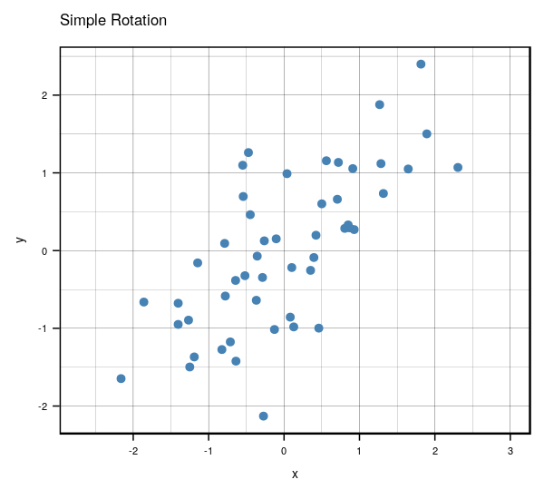
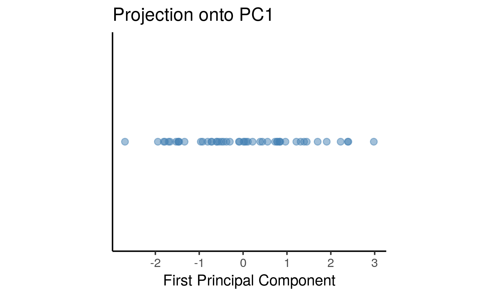
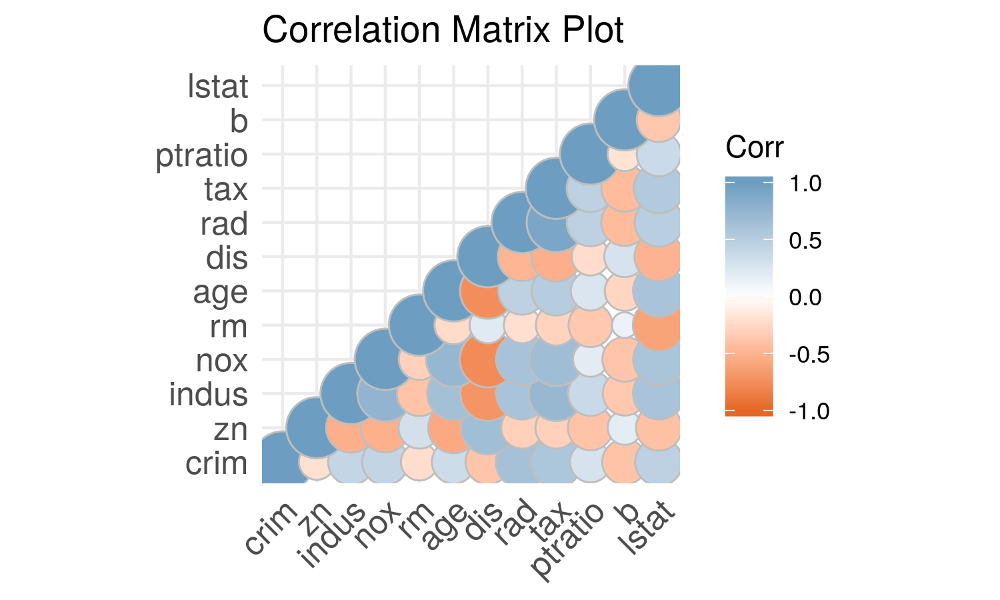
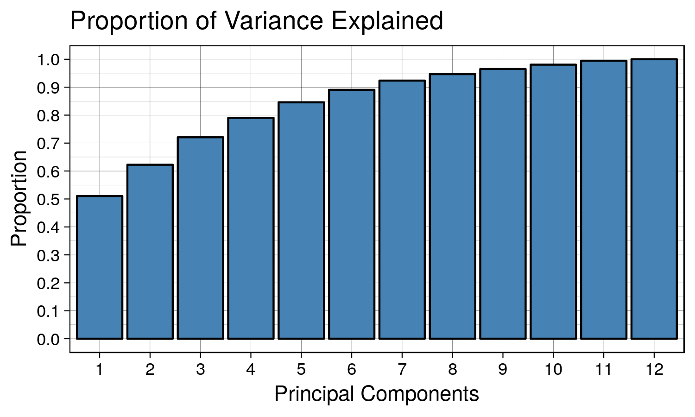
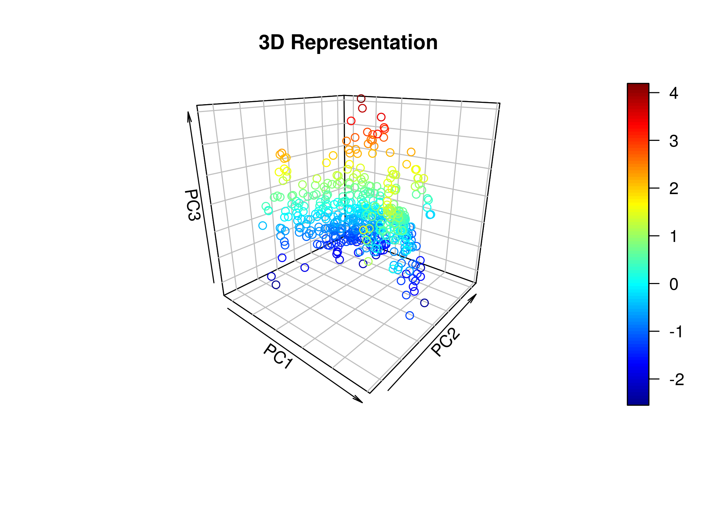

 <link rel='stylesheet' type='text/css' href='/projects/pca/pca.css'>

# **Introduction to Principal Component Analysis**

<p style="text-align:center;">

<em>Kenny Lov</em><br><br>

</p>

<p>

Ever been in a situation where you had to analyze a dataset with way too
many variables? Perhaps you wanted to somehow plot your data in a 2-D or
3-D graph while preserving as much information as possible? Was there
also high correlation and thus information redundancy among those
variables? If you answered <b>yes</b> to all of these questions, then
<i>Principal Components Analysis</i> is be a powerful dimensionality
reduction tool that should be in your arsenal!

</p>

Quick overview of the technique:

<ol>

<li>

Center the dataset \(X\) that has \(n\) observations and \(d\) variables
(also scale features if necessary)

</li>

<li>

Compute the sample covariance matrix of \(X\),
\(Q \in {\rm I\!R}^{d \times d}\)

</li>

<li>

Diagonalize the sample covariance matrix \(Q\) such that it has the form
\(Q = PDP^T\), where \(P\) is an orthogonal matrix consisting of
\(\begin{bmatrix} \mathbf{v_1} \mathbf{v_2} ... \mathbf{v_d} \end{bmatrix}\)
and \(D\) is a diagonal matrix such that Diag(\(D\))
\(= \lambda_1, \lambda_2, ..., \lambda_d\), where each \(\mathbf{v_i}\)
is an eigenvector of \(Q\) that corresponds to its eigenvalue
\(\lambda_i\)

</li>

<li>

Decide the number of principal components to use (\(k\)), such that
\(k \leq d\), and set
\(P_k = \begin{bmatrix} \mathbf{v_1} \mathbf{v_2} ... \mathbf{v_k} \end{bmatrix} \in {\rm I\!R}^{d \times k}\)

</li>

<li>

Transform the original vectors \(X\) to \(Z\) by projecting onto the
lower dimensional linear subspace spanned by the \(k\) eigenvectors by
computing \(Z = XP_k \in {\rm I\!R}^{n \times k}\)

</li>

<li>

The columns of \(Z\) will be referred to as the principal components and
have the nice property of orthogonality. Each principal component is a
linear combination of the original features:
\(z_{i}= \phi_{i1}x_{i1} + \phi_{i2}x_{2} + ... + \phi_{id}x_{d}\) where
each \(\phi\) is a loading (component of \(i\)th eigenvector) for the
corresponding principal component.

</li>

</ol>

## Table of Contents

1.  [Applications](#applications)
2.  [The Algorithm](#the-algorithm)
3.  [Selecting Number of Principal
    Components](#selecting-number-of-principal-components)
4.  [Example](#example)
5.  [Conclusion](#Conclusion)

## Applications

## The Algorithm

The steps listed above may seem daunting at first, but it is rather
straightforward. Let’s get started with some generated sample data.
Although this technique applies to higher dimensional data, it is easier
to visualize what is happening with a simple 2D example and project it
onto a 1D subspace (essentially onto a line).

``` r
set.seed(123) # set seed for reproducibility

# create data that is moderately correlated
x <- rnorm(50, mean = 5, sd = 1)
y <- x + rnorm(50, mean = 0, sd = 1)
X <- data.frame(x = x, y = y)
```

Now let’s visualize the data \(X\):

``` r
library(ggplot2)
th <- theme_linedraw() # setting the theme for the plots
tiff('./images/plot1.tiff', units="in", width=5, height=3, res=300)

ggplot(X, aes(x= x, y = y)) +
  geom_point(size = 1.5, color = 'steelblue') +
  labs(title = "Our Example") + 
  th + theme(aspect.ratio = 0.8) 

garb <- dev.off()
```


<p>

Great, now we will center the data by subtracting the mean of each
feature and compute the sample covariance matrix \(Q\).

</p>

``` r
X_cent <- scale(X, center = TRUE, scale = TRUE)
Q = var(X_cent)

t1 <- kable(Q, align = 'clc',
            caption = "Covariance Matrix",
            format = "html") %>% kable_styling(full_width = F)
```

<div id = "cov_mat">

<table class="table" style="width: auto !important; margin-left: auto; margin-right: auto;">

<caption>

Covariance Matrix

</caption>

<thead>

<tr>

<th style="text-align:left;">

</th>

<th style="text-align:center;">

x

</th>

<th style="text-align:left;">

y

</th>

</tr>

</thead>

<tbody>

<tr>

<td style="text-align:left;">

x

</td>

<td style="text-align:center;">

1.0000000

</td>

<td style="text-align:left;">

0.7025812

</td>

</tr>

<tr>

<td style="text-align:left;">

y

</td>

<td style="text-align:center;">

0.7025812

</td>

<td style="text-align:left;">

1.0000000

</td>

</tr>

</tbody>

</table>

</div>

<br>

<p>

Now, we will diagonalize the sample covariance matrix \(Q\) such that it
has the form \(Q = PDP^T\) via spectral decomposition.

</p>

In R this is done using the `eigen` function, which returns a list of
eigenvalues and the corresponding eigenvectors of the provided matrix.

``` r
eig <- eigen(Q)
D <- diag(eig$values)
P <- eig$vectors # Q = PDP^T

# project X onto the eigen subspace
Z <- as.matrix(X_cent) %*% P
```

This is the graph we get once we project the data onto the linear
subspace spanned by the first two eigenvectors.

``` r
library(gridExtra)
Z_df <- data.frame(x = Z[,1], y = Z[,2])
g1 <- ggplot(Z_df , aes(x= x, y = y)) +
  geom_point(size = 1.5, color = 'steelblue') +
  labs(title = "Principal Components") + ylim(-2,2) + labs(x = 'PC1', y = 'PC2') +
  th + theme(aspect.ratio = 0.8) 

X_cent_df <- data.frame(X_cent)
g2 <- ggplot(X_cent_df, aes(x= x, y = y)) +
  geom_point(size = 1.5, color = 'steelblue') +
  labs(title = "Centered X") + 
  th + theme(aspect.ratio = 0.8) 

tiff('./images/plot2.tiff', units="in", width=10, height=5, res=600)
grid.arrange(g2, g1, nrow=1, respect=TRUE)
garb <- dev.off()
```


<p>

Very interesting results, huh? If you look carefully, you’ll notice
something really cool. What would happen if you were to <b>rotate</b>
the centered \(X\) clockwise just a bit…?

</p>

<!-- -->

<p>

Anyways, that’s what essentially happens if you use the same number of
eigenvectors (\(k = d\)) as there are features in the original data. It
becomes a matrix that encodes a rotation operator. It changes the basis
of \(X\) from the standard basis to an eigenbasis. Cool stuff, but if
you want to actually reduce the dimensions of your data, you will want
to use a \(k < d\), so in this case let’s make \(k = 1\) such that
\(P_1 \in {\rm I\!R}^{d \times 1}\). To visualize what will happen,
let’s plot the subspace that is spanned by the first eigenvector
(indicated by the red line). Keep in mind that this is the direction of
the highest variance in the data.

</p>

``` r
tiff('./images/plot3.tiff', units="in", width=5, height=5, res=100)
plot(X_cent_df, pty = 's', pch = 19, col = '#4682b4')
title("Centered X")
abline(a = 0, b =  P[2,1] / P[1,1], col = 'red', lwd = 3)
garb <- dev.off()
```


Now you might be thinking… this looks quite similar to a simple linear
regression right? Wrong\! OLS regression aims to find parameters
minimize the sum of squares of the errors while PCA aims to find the
best surface to project the data onto such that the orthogonal
projection error is minimized. Here’s a diagram of what I mean:

``` r
ols.segment.coord <- function(x0, y0, lm.mod){
 #finds endpoint for a perpendicular segment from the point (x0,y0) to the line
 # defined by lm.mod as y=a+b*x
  a <- coef(lm.mod)[1] #intercept
  b <- coef(lm.mod)[2] #slope
  x1 <- x0
  y1 <- a + b*x1
  list(x0=x0, y0=y0, x1=x1, y1=y1)
}

perp.segment.coord <- function(x0, y0){
 #finds endpoint for a perpendicular segment from the point (x0,y0) to the line
 # defined by lm.mod as y=a+b*x
  a <- 0 #intercept
  b <- P[2,1] / P[1,1] #slope
  x1 <- (x0+b*y0-a*b)/(1+b^2)
  y1 <- a + b*x1
  list(x0=x0, y0=y0, x1=x1, y1=y1)
}

tiff('./images/plot4.tiff', units="in", width=10, height=5, res=600)

par(mfrow=c(1,2)) # display 2 plots, one row two columns

plot(X_cent_df, pty = 's', pch = 19, col = '#4682b4')
title("Centered X (OLS)")
abline(lm(y~x, X_cent_df), col = 'red', lwd = 3)
ss <- ols.segment.coord(X_cent_df$x, X_cent_df$y, lm(y~x, X_cent_df))
do.call(segments, c(ss, list(col = 'red', lwd = 1, lty = 2)))

plot(X_cent_df, pty = 's', pch = 19, col = '#4682b4')
title("Centered X (PC)")
abline(a = 0, b =  P[2,1] / P[1,1], col = 'red', lwd = 3)
ss <- perp.segment.coord(X_cent_df$x, X_cent_df$y)
do.call(segments, c(ss, list(col = 'red', lwd = 1, lty = 2)))

garb <- dev.off()
```


<p>

As you can see, OLS minimizes errors from \(\hat{y} - y\) while PCA
seeks to minimize the orthogonal variance. So what happens to the data
once we project it onto the line? Well, it will look like this:

</p>

``` r
P_k <- P[,1] # select the first eigenvector (2x1)
y <- X_cent %*% P_k # the first principal component is now in shape (nx1)
y_df <- data.frame(x=y, y = rep(0, length(y)))

tiff('./images/plot5.tiff', units="in", width=5, height=3, res=300)
ggplot(y_df, aes(x=x, y=y)) + 
  geom_point(size = 2, color = 'steelblue', alpha=0.5) + 
  labs(title = 'Projection onto PC1', x = 'First Principal Component') + 
  theme_classic() +
  theme(aspect.ratio = 0.8, axis.ticks.y = element_blank(), axis.text.y=element_blank(), axis.title.y=element_blank())
garb <- dev.off()
```



This can be seen as a lower dimensional representation of the data. We
have projected the data onto the axis of maximal variance.

## Selecting Number of Principal Components

<p>

In the case of higher dimensions, you might be wondering, how would I
select the number of principal components to use? That would depend on
your use case. For example, exploratory data analysis. The most common
application of PCA is for visualization, hence it seems reasonable to
project higher dimensional data onto 2 or 3 dimensions, allowing for a
geometric representation that hopefully captures most of the variation
in the data. <br> <br> Additionally, it is possible to use this
unsupervised learning technique in the context of supervised learning.
If the goal is to build a predictive model, the principal components can
be used as the features for the model in place of the original features.
Ideally, we would use as few components as possible to adequately
summarize the data. Although there isn’t a steadfast rule to follow, the
eigenvalues, accompanied by a <it>scree plot</it> (shown later) can be
helpful in making the decision. The variance explained by the \(m\)th
principal component is the eigenvalue that corresponds to that principal
component, and thus the proportion of explained variance for the first
\(m\) principal components is:

$$ \frac{ \sum^m_{i=1}\lambda_i }{\sum^d_{i=1}\lambda_i} $$

Plotting the proportion of explained variance against the number of
principal components provides some insight into how many principal
components to use.

</p>

## Example

Instead of a contrived, boring generated dataset, let’s examine one
that’s a bit more interesting. We’ll be using a dataset from R’s
`mlbench` library called BostonHousing.

<p>

Here’s a list of the variables and what they mean:

<ul>

<li>

crim: per capita crime rate by town

</li>

<li>

zn: proportion of residential land zoned for lots over 25,000 sq.ft

</li>

<li>

indus: proportion of non-retail business acres per town

</li>

<li>

chas: Charles River dummy variable (= 1 if tract bounds river; 0
otherwise)

</li>

<li>

nox: nitric oxides concentration (parts per 10 million)

</li>

<li>

rm: average number of rooms per dwelling

</li>

<li>

age: proportion of owner-occupied units built prior to 1940

</li>

<li>

dis: weighted distances to five Boston employment centres

</li>

<li>

rad: index of accessibility to radial highways

</li>

<li>

tax: full-value property-tax rate per USD 10,000

</li>

<li>

ptratio: pupil-teacher ratio by town

</li>

<li>

b: 1000(B - 0.63)^2 where B is the proportion of blacks by town

</li>

<li>

lstat: percentage of lower status of the population

</li>

<li>

medv: median value of owner-occupied homes in USD 1000’s

</li>

</ul>

</p>

``` r
library(mlbench)
data(BostonHousing) # load the data
housing <- BostonHousing
housing <- housing[, !names(housing) %in% c('chas', 'medv')] # remove chas because not numeric. also remove medv because highly correlated every variable
kable(head(housing), format = "html") # take a look at first few observations
```

<table>

<thead>

<tr>

<th style="text-align:right;">

crim

</th>

<th style="text-align:right;">

zn

</th>

<th style="text-align:right;">

indus

</th>

<th style="text-align:right;">

nox

</th>

<th style="text-align:right;">

rm

</th>

<th style="text-align:right;">

age

</th>

<th style="text-align:right;">

dis

</th>

<th style="text-align:right;">

rad

</th>

<th style="text-align:right;">

tax

</th>

<th style="text-align:right;">

ptratio

</th>

<th style="text-align:right;">

b

</th>

<th style="text-align:right;">

lstat

</th>

</tr>

</thead>

<tbody>

<tr>

<td style="text-align:right;">

0.00632

</td>

<td style="text-align:right;">

18

</td>

<td style="text-align:right;">

2.31

</td>

<td style="text-align:right;">

0.538

</td>

<td style="text-align:right;">

6.575

</td>

<td style="text-align:right;">

65.2

</td>

<td style="text-align:right;">

4.0900

</td>

<td style="text-align:right;">

1

</td>

<td style="text-align:right;">

296

</td>

<td style="text-align:right;">

15.3

</td>

<td style="text-align:right;">

396.90

</td>

<td style="text-align:right;">

4.98

</td>

</tr>

<tr>

<td style="text-align:right;">

0.02731

</td>

<td style="text-align:right;">

0

</td>

<td style="text-align:right;">

7.07

</td>

<td style="text-align:right;">

0.469

</td>

<td style="text-align:right;">

6.421

</td>

<td style="text-align:right;">

78.9

</td>

<td style="text-align:right;">

4.9671

</td>

<td style="text-align:right;">

2

</td>

<td style="text-align:right;">

242

</td>

<td style="text-align:right;">

17.8

</td>

<td style="text-align:right;">

396.90

</td>

<td style="text-align:right;">

9.14

</td>

</tr>

<tr>

<td style="text-align:right;">

0.02729

</td>

<td style="text-align:right;">

0

</td>

<td style="text-align:right;">

7.07

</td>

<td style="text-align:right;">

0.469

</td>

<td style="text-align:right;">

7.185

</td>

<td style="text-align:right;">

61.1

</td>

<td style="text-align:right;">

4.9671

</td>

<td style="text-align:right;">

2

</td>

<td style="text-align:right;">

242

</td>

<td style="text-align:right;">

17.8

</td>

<td style="text-align:right;">

392.83

</td>

<td style="text-align:right;">

4.03

</td>

</tr>

<tr>

<td style="text-align:right;">

0.03237

</td>

<td style="text-align:right;">

0

</td>

<td style="text-align:right;">

2.18

</td>

<td style="text-align:right;">

0.458

</td>

<td style="text-align:right;">

6.998

</td>

<td style="text-align:right;">

45.8

</td>

<td style="text-align:right;">

6.0622

</td>

<td style="text-align:right;">

3

</td>

<td style="text-align:right;">

222

</td>

<td style="text-align:right;">

18.7

</td>

<td style="text-align:right;">

394.63

</td>

<td style="text-align:right;">

2.94

</td>

</tr>

<tr>

<td style="text-align:right;">

0.06905

</td>

<td style="text-align:right;">

0

</td>

<td style="text-align:right;">

2.18

</td>

<td style="text-align:right;">

0.458

</td>

<td style="text-align:right;">

7.147

</td>

<td style="text-align:right;">

54.2

</td>

<td style="text-align:right;">

6.0622

</td>

<td style="text-align:right;">

3

</td>

<td style="text-align:right;">

222

</td>

<td style="text-align:right;">

18.7

</td>

<td style="text-align:right;">

396.90

</td>

<td style="text-align:right;">

5.33

</td>

</tr>

<tr>

<td style="text-align:right;">

0.02985

</td>

<td style="text-align:right;">

0

</td>

<td style="text-align:right;">

2.18

</td>

<td style="text-align:right;">

0.458

</td>

<td style="text-align:right;">

6.430

</td>

<td style="text-align:right;">

58.7

</td>

<td style="text-align:right;">

6.0622

</td>

<td style="text-align:right;">

3

</td>

<td style="text-align:right;">

222

</td>

<td style="text-align:right;">

18.7

</td>

<td style="text-align:right;">

394.12

</td>

<td style="text-align:right;">

5.21

</td>

</tr>

</tbody>

</table>

Let’s take a look at how each of the variables are correlated with each
other.

``` r
library(ggcorrplot)
M <- cor(housing)
tiff('./images/plot6.tiff', units="in", width=5, height=3, res=600)
ggcorrplot(M, method = 'square', type = 'lower', show.diag = TRUE,
           colors = c("#E46726", "white", "#6D9EC1"), title = 'Correlation Matrix Plot', pch=1)
garb <- dev.off()
```



<p>

The diagonals are clearly 1 because a variable is always 100% correlated
with itself. In general it appears that there is high correlation among
the variables. Running a OLS regression with these variables will lead
to violation of assumptions such as multicollinearity and will not allow
for proper statistical inference (analysis of p-values and such). For
example, there is also high correlation between the nitric oxide
concentration and proportion of owner-occupied units built prior to
1940. Additionally, tax appears to be highly correlated to how
accessible highways are in the area. Great, now that we have a better
understanding of our data, let’s see how principal component analysis
can be useful!

</p>

We’ll be using R’s `prcomp` because it instantiates a class with useful
methods.

``` r
# first let's scale the data
housing.sc <- scale(housing, center = TRUE, scale = TRUE)
housing.pca <- prcomp(housing.sc) # create a prcomp object
summary(housing.pca)
```

    ## Importance of components:
    ##                           PC1    PC2     PC3     PC4     PC5     PC6
    ## Standard deviation     2.4752 1.1587 1.08618 0.91382 0.81527 0.73308
    ## Proportion of Variance 0.5106 0.1119 0.09832 0.06959 0.05539 0.04478
    ## Cumulative Proportion  0.5106 0.6224 0.72075 0.79034 0.84573 0.89051
    ##                            PC7     PC8     PC9    PC10    PC11    PC12
    ## Standard deviation     0.62962 0.52637 0.46932 0.43146 0.41148 0.25426
    ## Proportion of Variance 0.03303 0.02309 0.01836 0.01551 0.01411 0.00539
    ## Cumulative Proportion  0.92355 0.94663 0.96499 0.98050 0.99461 1.00000

Notice that the cumulative proportion explained (third row) corresponds
to the equation above. Here are the eigenvalues for
    reference:

    ##  [1] 6.12671880 1.34247929 1.17978483 0.83506595 0.66467141 0.53740698
    ##  [7] 0.39641745 0.27706753 0.22026544 0.18616148 0.16931520 0.06464564

We can use a scree plot to show how the number of principal components
affects the cumulative proportion explained.

``` r
tiff('./images/plot7.tiff', units="in", width=5, height=3, res=300)
ggplot(data.frame(y = summary(housing.pca)$importance[3,], x = as.factor(1:12)), aes(x = x, y = y)) +
         geom_bar(stat = 'identity', fill = 'steelblue', color = 'black') +
         scale_y_continuous(breaks = seq(0,1,0.1)) +
         labs(title = 'Proportion of Variance Explained', x = 'Principal Components', y = 'Proportion') + th
garb <- dev.off()
```



We can see that as we keep adding more principal components, the
proportion of explained variance increases. The first principal
component explains ~50% of the variation in data. The first and second
principal component explain ~60% of the variation in the data. A good
number to pick would be the number of principal components that explains
~90% of the data. In this case it would be 7.

### Interpretation

Awesome, but what does each principal component actually mean? We’ll
need to take a look at each of the loadings. Although it varies by use
case people often compare interpreting principal components to *reading
tea leaves*. Sometimes principal components don’t have strong
correlation with the original variables, so it’s hard to make definitive
interpretations.

``` r
kable(housing.pca$rotation[,1:7], format = "html") # select first 7 principal component loadings
```

<table>

<thead>

<tr>

<th style="text-align:left;">

</th>

<th style="text-align:right;">

PC1

</th>

<th style="text-align:right;">

PC2

</th>

<th style="text-align:right;">

PC3

</th>

<th style="text-align:right;">

PC4

</th>

<th style="text-align:right;">

PC5

</th>

<th style="text-align:right;">

PC6

</th>

<th style="text-align:right;">

PC7

</th>

</tr>

</thead>

<tbody>

<tr>

<td style="text-align:left;">

crim

</td>

<td style="text-align:right;">

0.2510194

</td>

<td style="text-align:right;">

-0.4012494

</td>

<td style="text-align:right;">

0.0690589

</td>

<td style="text-align:right;">

-0.0753712

</td>

<td style="text-align:right;">

0.2081169

</td>

<td style="text-align:right;">

-0.7788347

</td>

<td style="text-align:right;">

0.1582304

</td>

</tr>

<tr>

<td style="text-align:left;">

zn

</td>

<td style="text-align:right;">

-0.2562763

</td>

<td style="text-align:right;">

-0.4391012

</td>

<td style="text-align:right;">

0.0907976

</td>

<td style="text-align:right;">

-0.3045328

</td>

<td style="text-align:right;">

0.3517354

</td>

<td style="text-align:right;">

0.2706330

</td>

<td style="text-align:right;">

-0.4033599

</td>

</tr>

<tr>

<td style="text-align:left;">

indus

</td>

<td style="text-align:right;">

0.3466252

</td>

<td style="text-align:right;">

0.1082654

</td>

<td style="text-align:right;">

0.0314750

</td>

<td style="text-align:right;">

0.0103298

</td>

<td style="text-align:right;">

0.0909465

</td>

<td style="text-align:right;">

0.3404285

</td>

<td style="text-align:right;">

0.1732134

</td>

</tr>

<tr>

<td style="text-align:left;">

nox

</td>

<td style="text-align:right;">

0.3427732

</td>

<td style="text-align:right;">

0.1653885

</td>

<td style="text-align:right;">

0.2363494

</td>

<td style="text-align:right;">

-0.1481618

</td>

<td style="text-align:right;">

0.1436105

</td>

<td style="text-align:right;">

0.1901088

</td>

<td style="text-align:right;">

0.0767351

</td>

</tr>

<tr>

<td style="text-align:left;">

rm

</td>

<td style="text-align:right;">

-0.1893443

</td>

<td style="text-align:right;">

-0.0767626

</td>

<td style="text-align:right;">

0.6786280

</td>

<td style="text-align:right;">

0.3931775

</td>

<td style="text-align:right;">

-0.1046867

</td>

<td style="text-align:right;">

-0.0775791

</td>

<td style="text-align:right;">

-0.3299394

</td>

</tr>

<tr>

<td style="text-align:left;">

age

</td>

<td style="text-align:right;">

0.3135926

</td>

<td style="text-align:right;">

0.3154976

</td>

<td style="text-align:right;">

0.1644670

</td>

<td style="text-align:right;">

-0.0341532

</td>

<td style="text-align:right;">

0.0422617

</td>

<td style="text-align:right;">

-0.1286496

</td>

<td style="text-align:right;">

-0.6022184

</td>

</tr>

<tr>

<td style="text-align:left;">

dis

</td>

<td style="text-align:right;">

-0.3214520

</td>

<td style="text-align:right;">

-0.3273196

</td>

<td style="text-align:right;">

-0.2542048

</td>

<td style="text-align:right;">

-0.0764528

</td>

<td style="text-align:right;">

0.0108328

</td>

<td style="text-align:right;">

0.1149307

</td>

<td style="text-align:right;">

-0.1189003

</td>

</tr>

<tr>

<td style="text-align:left;">

rad

</td>

<td style="text-align:right;">

0.3198193

</td>

<td style="text-align:right;">

-0.3843764

</td>

<td style="text-align:right;">

0.1131343

</td>

<td style="text-align:right;">

0.2173470

</td>

<td style="text-align:right;">

0.1639420

</td>

<td style="text-align:right;">

0.1400495

</td>

<td style="text-align:right;">

0.0805718

</td>

</tr>

<tr>

<td style="text-align:left;">

tax

</td>

<td style="text-align:right;">

0.3385180

</td>

<td style="text-align:right;">

-0.3205710

</td>

<td style="text-align:right;">

0.0780306

</td>

<td style="text-align:right;">

0.1410950

</td>

<td style="text-align:right;">

0.2100012

</td>

<td style="text-align:right;">

0.3104240

</td>

<td style="text-align:right;">

0.0793716

</td>

</tr>

<tr>

<td style="text-align:left;">

ptratio

</td>

<td style="text-align:right;">

0.2050739

</td>

<td style="text-align:right;">

-0.1727336

</td>

<td style="text-align:right;">

-0.4851667

</td>

<td style="text-align:right;">

0.6081498

</td>

<td style="text-align:right;">

-0.2457383

</td>

<td style="text-align:right;">

0.0141723

</td>

<td style="text-align:right;">

-0.3133497

</td>

</tr>

<tr>

<td style="text-align:left;">

b

</td>

<td style="text-align:right;">

-0.2030293

</td>

<td style="text-align:right;">

0.3362515

</td>

<td style="text-align:right;">

-0.1880326

</td>

<td style="text-align:right;">

0.3633027

</td>

<td style="text-align:right;">

0.8100186

</td>

<td style="text-align:right;">

-0.0921106

</td>

<td style="text-align:right;">

-0.0082317

</td>

</tr>

<tr>

<td style="text-align:left;">

lstat

</td>

<td style="text-align:right;">

0.3098245

</td>

<td style="text-align:right;">

0.0336452

</td>

<td style="text-align:right;">

-0.2971503

</td>

<td style="text-align:right;">

-0.3859245

</td>

<td style="text-align:right;">

0.0609642

</td>

<td style="text-align:right;">

-0.0877557

</td>

<td style="text-align:right;">

-0.4238643

</td>

</tr>

</tbody>

</table>

The principal components are the columns and the rows are the original
variables. The values indicate how much weight the original variable has
on the PC. A larger weight in the PC suggests that the original variable
is represented more strongly in that PC. For example, the first
principal component seems to be moderately correlated with all of the
original variables. In this case, it is difficult to interpret. Although
it explains most of the variation in the data, PC1 doesn’t have a very
strong *meaning* or *attribute*. PC2 seems mostly correlated with crim,
zn, rad, perhaps suggesting that it may be related to how wealthy the
neighborhood is.

On the other hand, if we wanted to visualize the data in a lower
dimensional representation, we can use the first 3 principal components
and apply the transformation to the original dataset. It will provide a
3-D plot that looks like this:

``` r
library(plot3D)
Z <- housing.sc  %*% housing.pca$rotation[,1:3]
tiff('./images/plot8.tiff', units="in", width=7, height=5, res=300)
scatter3D(x = Z[,1], y = Z[,2], z = Z[,3], main = "3D Representation", xlab = 'PC1', ylab = 'PC2', zlab = 'PC3', 
          phi=20, bty ="b2")
garb <- dev.off()
```



Perhaps with this particular dataset, there aren’t meaningful groupings
or clusters we can infer from a lower dimensional visualization of the
data.

## Conclusion
