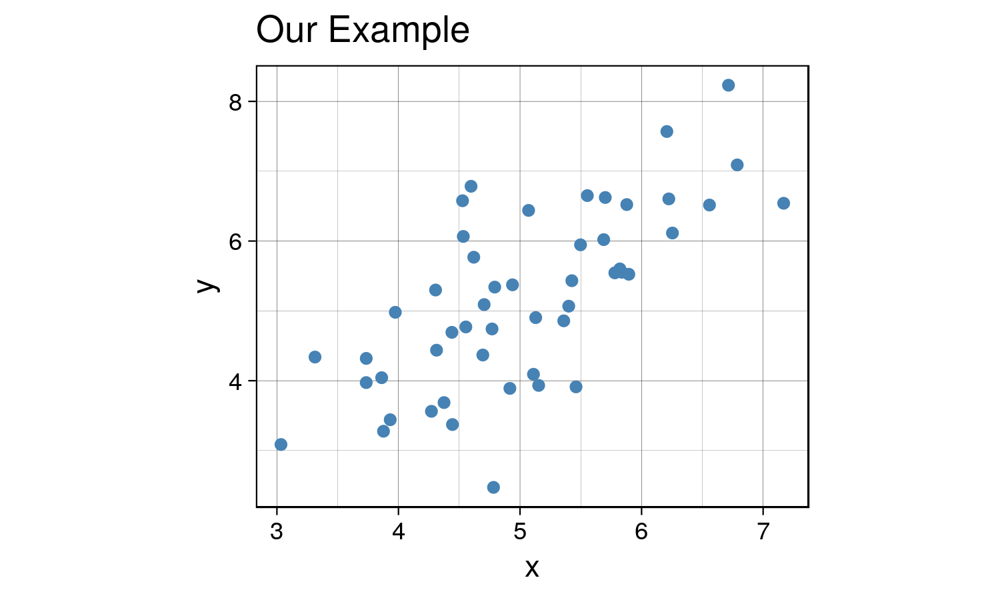
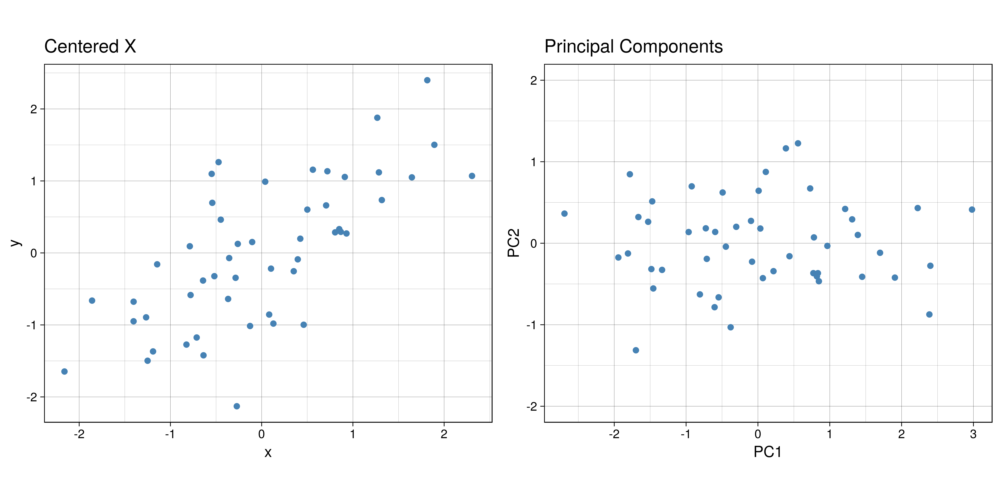
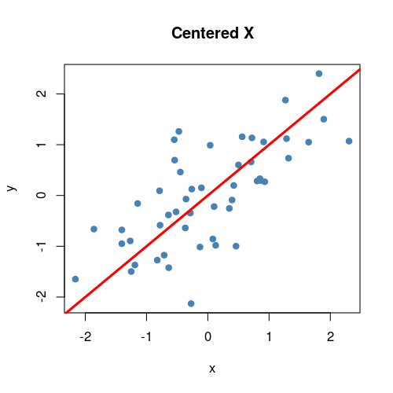
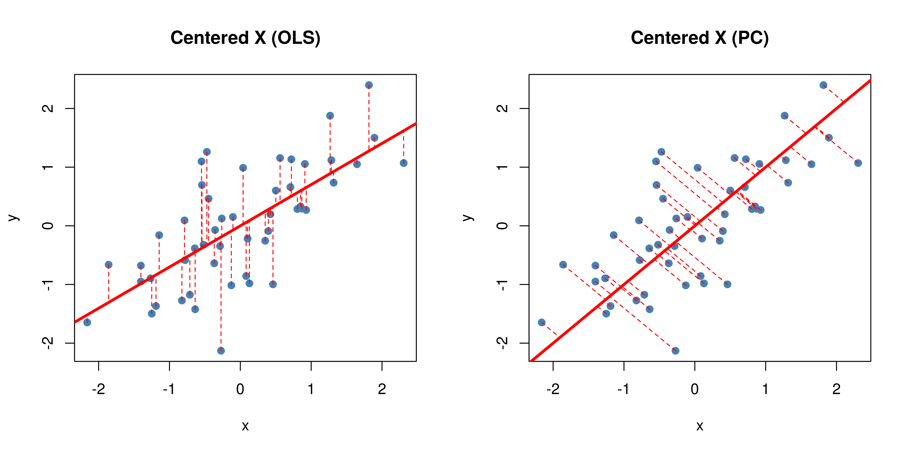

 <link rel='stylesheet' type='text/css' href='/projects/pca/pca.css'>

# **Introduction to Principal Component Analysis**

<p style="text-align:center;">

<em>Kenny Lov</em><br><br>

</p>

<p>

Ever been in a situation where you had to analyze a dataset with way too
many variables? Perhaps you wanted to somehow plot your data in a 2-D or
3-D graph while preserving as much information as possible? Was there
also high correlation and thus information redundancy among those
variables? If you answered <b>yes</b> to all of these questions, then
<i>Principal Components Analysis</i> is be a powerful dimensionality
reduction tool that should be in your arsenal!

</p>

Quick overview of the technique:

<ol>

<li>

Center the dataset \(X\) that has \(n\) observations and \(d\) variables
(also scale features if necessary)

</li>

<li>

Compute the sample covariance matrix of \(X\),
\(Q \in {\rm I\!R}^{d \times d}\)

</li>

<li>

Diagonalize the sample covariance matrix \(Q\) such that it has the form
\(Q = PDP^T\), where \(P\) is an orthogonal matrix consisting of
\(\begin{bmatrix} \mathbf{v_1} \mathbf{v_2} ... \mathbf{v_d} \end{bmatrix}\)
and \(D\) is a diagonal matrix such that Diag(\(D\))
\(= \lambda_1, \lambda_2, ..., \lambda_d\), where each \(\mathbf{v_i}\)
is an eigenvector of \(Q\) that corresponds to its eigenvalue
\(\lambda_i\)

</li>

<li>

Decide the number of principal components to use (\(k\)), such that
\(k \leq d\), and set
\(P_k = \begin{bmatrix} \mathbf{v_1} \mathbf{v_2} ... \mathbf{v_k} \end{bmatrix} \in {\rm I\!R}^{d \times k}\)

</li>

<li>

Transform the original vectors \(X\) to \(Z\) by projecting onto the
lower dimensional linear subspace spanned by the \(k\) eigenvectors by
computing \(Z = XP_k \in {\rm I\!R}^{n \times k}\)

</li>

<li>

The columns of \(Z\) will be referred to as the principal components and
have the nice property of orthogonality. Each principal component is a
linear combination of the original features:
\(z_{i}= \phi_{i1}x_{i1} + \phi_{i2}x_{2} + ... + \phi_{id}x_{d}\) where
each \(\phi\) is a loading for the corresponding principal component.

</li>

</ol>

## Table of Contents

1.  [Applications](#applications)
2.  [The Algorithm](#the-algorithm)
3.  [Selecting Number of
    Eigenvectors](#selecting-number-of-eigenvectors)
4.  [Example](#example)

## Applications

## The Algorithm

The steps listed above may seem daunting at first, but it is rather
straightforward. Let’s get started with some generated sample data.
Although this technique applies to higher dimensional data, it is easier
to visualize what is happening with a simple 2D example and project it
onto a 1D subspace (essentially onto a line).

``` r
set.seed(123) # set seed for reproducibility

# create data that is moderately correlated
x <- rnorm(50, mean = 5, sd = 1)
y <- x + rnorm(50, mean = 0, sd = 1)
X <- data.frame(x = x, y = y)
```

Now let’s visualize the data \(X\):

``` r
library(ggplot2)
th <- theme_linedraw() # setting the theme for the plots
tiff('./images/plot1.tiff', units="in", width=5, height=3, res=300)

ggplot(X, aes(x= x, y = y)) +
  geom_point(size = 1.5, color = 'steelblue') +
  labs(title = "Our Example") + 
  th + theme(aspect.ratio = 0.8) 

garb <- dev.off()
```



<p>

Great, now we will center the data by subtracting the mean of each
feature and compute the sample covariance matrix \(Q\).

</p>

``` r
X_cent <- scale(X, center = TRUE, scale = TRUE)
Q = var(X_cent)

t1 <- kable(Q, align = 'clc',
            caption = "Covariance Matrix",
            format = "html") %>% kable_styling(full_width = F)
```

<div id = "cov_mat">

<table class="table" style="width: auto !important; margin-left: auto; margin-right: auto;">

<caption>

Covariance Matrix

</caption>

<thead>

<tr>

<th style="text-align:left;">

</th>

<th style="text-align:center;">

x

</th>

<th style="text-align:left;">

y

</th>

</tr>

</thead>

<tbody>

<tr>

<td style="text-align:left;">

x

</td>

<td style="text-align:center;">

1.0000000

</td>

<td style="text-align:left;">

0.7025812

</td>

</tr>

<tr>

<td style="text-align:left;">

y

</td>

<td style="text-align:center;">

0.7025812

</td>

<td style="text-align:left;">

1.0000000

</td>

</tr>

</tbody>

</table>

</div>

<br>

<p>

Now, we will diagonalize the sample covariance matrix \(Q\) such that it
has the form \(Q = PDP^T\) via spectral decomposition.

</p>

In R this is done using the `eigen` function, which returns a list of
eigenvalues and the corresponding eigenvectors of the provided matrix.

``` r
eig <- eigen(Q)
D <- diag(eig$values)
P <- eig$vectors # Q = PDP^T

# project X onto the eigen subspace
Z <- as.matrix(X_cent) %*% P
```

This is the graph we get once we project the data onto the linear
subspace spanned by the first two eigenvectors.

``` r
library(gridExtra)
Z_df <- data.frame(x = Z[,1], y = Z[,2])
g1 <- ggplot(Z_df , aes(x= x, y = y)) +
  geom_point(size = 1.5, color = 'steelblue') +
  labs(title = "Principal Components") + ylim(-2,2) + labs(x = 'PC1', y = 'PC2') +
  th + theme(aspect.ratio = 0.8) 

X_cent_df <- data.frame(X_cent)
g2 <- ggplot(X_cent_df, aes(x= x, y = y)) +
  geom_point(size = 1.5, color = 'steelblue') +
  labs(title = "Centered X") + 
  th + theme(aspect.ratio = 0.8) 

tiff('./images/plot2.tiff', units="in", width=10, height=5, res=600)
grid.arrange(g2, g1, nrow=1, respect=TRUE)
garb <- dev.off()
```



<p>

Very interesting results, huh? If you look carefully, you’ll notice
something really cool. What would happen if you were to <b>rotate</b>
the centered \(X\) clockwise just a bit…?

</p>

<!-- -->

<p>

Anyways, that’s what essentially happens if you use the same number of
eigenvectors (\(k = d\)) as there are features in the original data. It
becomes a matrix that encodes a rotation operator. It changes the basis
of \(X\) from the standard basis to an eigenbasis. Cool stuff, but if
you want to actually reduce the dimensions of your data, you will want
to use a \(k < d\), so in this case let’s make \(k = 1\) such that
\(P_1 \in {\rm I\!R}^{d \times 1}\). To visualize what will happen,
let’s plot the subspace that is spanned by the first eigenvector
(indicated by the red line). Keep in mind that this is the direction of
the highest variance in the data.

</p>

``` r
tiff('./images/plot3.tiff', units="in", width=5, height=5, res=100)
plot(X_cent_df, pty = 's', pch = 19, col = '#4682b4')
title("Centered X")
abline(a = 0, b =  P[2,1] / P[1,1], col = 'red', lwd = 3)
garb <- dev.off()
```



Now you might be thinking… this looks quite similar to a simple linear
regression right? Wrong\! OLS regression aims to find parameters
minimize the sum of squares of the errors while PCA aims to find the
best surface to project the data onto such that the orthogonal
projection error is minimized. Here’s a diagram of what I mean:

``` r
ols.segment.coord <- function(x0, y0, lm.mod){
 #finds endpoint for a perpendicular segment from the point (x0,y0) to the line
 # defined by lm.mod as y=a+b*x
  a <- coef(lm.mod)[1] #intercept
  b <- coef(lm.mod)[2] #slope
  x1 <- x0
  y1 <- a + b*x1
  list(x0=x0, y0=y0, x1=x1, y1=y1)
}

perp.segment.coord <- function(x0, y0){
 #finds endpoint for a perpendicular segment from the point (x0,y0) to the line
 # defined by lm.mod as y=a+b*x
  a <- 0 #intercept
  b <- P[2,1] / P[1,1] #slope
  x1 <- (x0+b*y0-a*b)/(1+b^2)
  y1 <- a + b*x1
  list(x0=x0, y0=y0, x1=x1, y1=y1)
}

tiff('./images/plot4.tiff', units="in", width=10, height=5, res=600)

par(mfrow=c(1,2)) # display 2 plots, one row two columns

plot(X_cent_df, pty = 's', pch = 19, col = '#4682b4')
title("Centered X (OLS)")
abline(lm(y~x, X_cent_df), col = 'red', lwd = 3)
ss <- ols.segment.coord(X_cent_df$x, X_cent_df$y, lm(y~x, X_cent_df))
do.call(segments, c(ss, list(col = 'red', lwd = 1, lty = 2)))

plot(X_cent_df, pty = 's', pch = 19, col = '#4682b4')
title("Centered X (PC)")
abline(a = 0, b =  P[2,1] / P[1,1], col = 'red', lwd = 3)
ss <- perp.segment.coord(X_cent_df$x, X_cent_df$y)
do.call(segments, c(ss, list(col = 'red', lwd = 1, lty = 2)))

garb <- dev.off()
```



<p>

As you can see, OLS minimizes errors from \(\hat{y} - y\) while PCA
seeks to minimize the orthogonal variance. So what happens to the data
once we project it onto the line? Well, it will look like this:

</p>

``` r
P_k <- P[,1] # select the first eigenvector (2x1)
y <- X_cent %*% P_k # the first principal component is now in shape (nx1)
y_df <- data.frame(x=y, y = rep(0, length(y)))

tiff('./images/plot5.tiff', units="in", width=3, height=3, res=300)
ggplot(y_df, aes(x=x, y=y)) + 
  geom_point(size = 2, color = 'steelblue', alpha=0.5) + 
  labs(title = 'Projection onto PC1', x = 'First Principal Component') + 
  theme_classic() +
  theme(aspect.ratio = 0.8, axis.ticks.y = element_blank(), axis.text.y=element_blank(), axis.title.y=element_blank())
garb <- dev.off()
```


## Selecting Number of Eigenvectors

<p>

You might be wondering, how would I select the number of principal
components to use? That would depend on your use case. For example,
exploratory data analysis. The most common application of PCA is for
visualization, hence it seems reasonable to project higher dimensional
data onto 2 or 3 dimensions, allowing for a geometric representation
that hopefully captures most of the variation in the data. <br> <br>
Additionally, it is possible to use this unsupervised learning technique
in the context of supervised learning. If the goal is to build a
predictive model, the principal components can be used as the features
for the model in place of the original features. Ideally, we would use
as few components as possible to adequately summarize the data. Although
there isn’t a steadfast rule to follow, the eigenvalues, accompanied by
a <it>scree plot</it> (shown later) can be helpful in making the
decision. The variance explained by the \(m)\)th principal component is
the eigenvalue that corresponds to that principal component, and thus
the proportion of explained variance for the first \(m\) principal
components is:

$$ \frac{ \sum^m_{i=1}\lambda_i }{\sum^d_{i=1}\lambda_i} $$

Plotting the proportion of explained variance against the number of
principal components provides some insight into how many principal
components to use.

</p>

## Example
