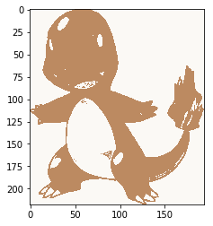
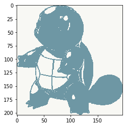

# Pokemon Type Classifier
*Kenny Lov*

*4/26/2018*

## Introduction

<style> nav ul li:nth-child(3) a {
  color: #45a29e; 
  text-decoration:underline;
  text-decoration-color:#45a29e;
  }
  
  img#pokemon-logo {
  position: relative;
  bottom: 20px;
}
</style>

<p style = "text-align: center">

<script src="https://ajax.googleapis.com/ajax/libs/jquery/3.3.1/jquery.min.js"></script>
<script src="//code.jquery.com/jquery-1.12.4.js"></script>
<script src="//code.jquery.com/ui/1.12.1/jquery-ui.js"></script>
<script>
$(document).ready(function(){
    $("img").mouseenter(function(){
        $("img").effect( effect = "shake", queue = false, duration = 200 );
    });
});
</script>


</p>

Playing pokemon as a kid, I've noticed that certain types would have The goal will be to see if we can classify a pokemon's type based on their base stats.

```python
import requests
from bs4 import BeautifulSoup
```


```python
main_page = requests.get('https://pokemondb.net/pokedex/all')
soup = BeautifulSoup(main_page.content, 'html.parser')
```


```python
poke_html_list = soup.select('a.ent-name')
poke_list = []
for poke in poke_html_list:
    if poke['href'] not in poke_list: poke_list.append(poke['href'])
```


```python
pokemon_list = []
base_stats = []
type_ = []

for pokemon in poke_list:
    page2 = requests.get('https://pokemondb.net' + pokemon)
    soup2 = BeautifulSoup(page2.content, 'html.parser')
    
    #print(pokemon)
    pokemon_list.append(soup2.select('article h1')[0].text)
    
    stats = soup2.select('div.colset table.vitals-table tbody td.num') #selecting all the numbers
    stat_numbers = []
    for index, i in enumerate(stats):
        if (index)%3 ==0: stat_numbers.append(i.text) #every 3 is one of the main stats
    base_stats.append(stat_numbers)
    
    
    types = soup2.select('table.vitals-table tbody tr a.type-icon')
    ind_type = []
    for i in types:
        ind_type.append(i.text)
    type_.append(list(set(ind_type)))

```


```python
hp = []
att = []
defs = []
spatt = []
spdef = []
spe = []

for i in base_stats:
    hp.append(i[0])
    att.append(i[1])
    defs.append(i[2])
    spatt.append(i[3])
    spdef.append(i[4])
    spe.append(i[5])
    
first_type = []
for i in type_:
    first_type.append(i[0])
```


```python
import pandas as pd
dataf = pd.DataFrame({'pokemon': pokemon_list,
                      'hp': hp,
                      'att': att,
                      'defs': defs,
                      'spatt': spatt,
                      'spdef': spdef,
                      'spe': spe,
                      'type': first_type,
                      'types': type_})


# Setting up the training and testing datasets
dataf2 = dataf.copy().drop('pokemon', axis=1).as_matrix()

train = dataf2[0:721]
trainX = train[:,0:5]
trainy = train[:,6]
test = dataf2[721:len(dataf), ]
testX = test[:,0:5]
testy = test[:,6]
testy2 = test[:,7]

```


```python
from sklearn import svm
svm_clf = svm.SVC(gamma = .00001, C = 1000)
svm_clf.fit(trainX, trainy)
print('svm class rate:', sum(svm_clf.predict(testX) == testy)/len(testy))

from sklearn import neighbors
knn_clf = neighbors.KNeighborsClassifier(n_neighbors = 2)
knn_clf.fit(trainX, trainy)
print('knn classification rate:', str(sum(knn_clf.predict(testX) == testy)/len(testy)))

```

    svm class rate: 0.13953488372093023
    knn classification rate: 0.12790697674418605


```python
two_colors = []

big_list = []
res3 = res2.tolist()

for i in res3:
    big_list.extend(i)
for i in big_list:
    in_list = i in two_colors
    if in_list == False: two_colors.append(i)

```


```python
import requests
import PIL
import io
import numpy as np
import cv2

poke_col_list = []

for pokemon in poke_list:
    page2 = requests.get('https://pokemondb.net' + pokemon)
    soup2 = BeautifulSoup(page2.content, 'html.parser')

    img_link = soup2.select('div.col.desk-span-4.lap-span-6.figure img')[0]['src']
    print(img_link)

    img = requests.get(img_link, stream=True)
    img.raw.decode_content = True
    image = PIL.Image.open(img.raw)


    img = cv2.cvtColor(np.array(image), cv2.COLOR_RGB2BGR)
    Z = img.reshape((-1,3))
    # convert to np.float32
    Z = np.float32(Z)
    # define criteria, number of clusters(K) and apply kmeans()
    criteria = (cv2.TERM_CRITERIA_EPS + cv2.TERM_CRITERIA_MAX_ITER, 10, 1.0)
    K = 2
    ret,label,center=cv2.kmeans(Z,K,None,criteria,10,cv2.KMEANS_RANDOM_CENTERS)
    # Now convert back into uint8, and make original image
    center = np.uint8(center)
    res = center[label.flatten()]
    res2 = res.reshape((img.shape))
    
    # extracting the two colors
    two_colors = []
    big_list = []
    res3 = res2.tolist()
    for i in res3:
        big_list.extend(i)
    for i in big_list:
        in_list = i in two_colors
        if in_list == False: two_colors.append(i)
    # the color that is farther away from 250 (white) is probably the pokemon's dominant color
    
    main_color = [sorted(two_colors)[0]] # each array is (BGR) instead of (RGB)
    poke_col_list.append(main_color)
    
```
<table style="width:100%">
  <tr>
    <th>Bulbasaur</th>
    <th>Charmander</th> 
    <th>Squirtle</th>
  </tr> 
    <th></th>
    <th></th> 
    <th></th>
    </table>


```python
poke_col_list_flat = []
for i in poke_col_list:
    for j in i:
        poke_col_list_flat.append(j)
b, g, r = zip(*poke_col_list_flat) # create new lists that correspond to blue, green, and red channel
```


```python
dataf['b'] = b
dataf['g'] = g
dataf['r'] = r
color = []
for i in range(0,len(dataf)):
    index = dataf.iloc[i]
    col = 'rgb'+str(tuple([index.r, index.g, index.b]))
    color.append(col)
dataf['color'] = color
dataf.pokemon
```


```python
import plotly.plotly as py
import plotly.graph_objs as go
import numpy as np

trace1 = go.Scatter3d(
    x=dataf['r'],
    y=dataf['b'],
    z=dataf['g'],
    mode='markers',
    marker=dict(
        color=dataf['color'],
        size=5,
        line=dict(
            color= dataf['color'],
            width=0.5
        ),
        opacity=0.8
    ),
    text = dataf.pokemon
)

data = [trace1]

layout = go.Layout(
    margin=dict(
        l=0,
        r=0,
        b=0,
        t=0
    ),
    scene = dict(
        xaxis = dict(title = 'Red'),
        yaxis = dict(title = 'Blue'),
        zaxis = dict(title = 'Green')
    ),
    paper_bgcolor='rgba(0,0,0,0)'
)
fig = go.Figure(data=data, layout=layout)
py.iplot(fig, filename='simple-3d-scatter')
```


<iframe id="igraph" scrolling="no" style="border:none;" seamless="seamless" src="https://plot.ly/~kennylov/61.embed" height="525px" width="100%"></iframe>


Interesting results... now, keeping the same axis, let's group by type to see if they're clustered.


```python
import random

color_type_dict = {}

for i in np.unique(dataf.type):
    red = random.randint(0,255)
    green = random.randint(0,255)
    blue = random.randint(0,255)
    color_type_dict[i] = 'rgb'+'('+ str(red) +',' + str(green)+',' + str(blue) + ')'

```


```python
color_type = []
for i in range(0,len(dataf)):
    p_type = dataf.iloc[i].type
    color_item = color_type_dict[p_type]
    col = color_item
    color_type.append(col)
    
dataf['color_type'] = color_type


trace2 = go.Scatter3d(
    x=dataf['r'],
    y=dataf['b'],
    z=dataf['g'],
    mode='markers',
    marker=dict(
        color=dataf['color_type'],
        size=5,
        line=dict(
            color= dataf['color_type'],
            width=0.5
        ),
        opacity=0.8
    ),
    text = dataf['type']
)

data2 = [trace2]

layout = go.Layout(
    margin=dict(
        l=0,
        r=0,
        b=0,
        t=0
    ),
    scene = dict(
        xaxis = dict(title = 'Red'),
        yaxis = dict(title = 'Blue'),
        zaxis = dict(title = 'Green')
    ),
    paper_bgcolor='rgba(0,0,0,0)'
)
fig = go.Figure(data=data2, layout=layout)
py.iplot(fig, filename='simple-3d-scatter')
```


<iframe id="igraph" scrolling="no" style="border:none;" seamless="seamless" src="https://plot.ly/~kennylov/63.embed" height="525px" width="100%"></iframe>


Just looking at this scatterplot, you can't really see any clusters of pokemon types based on colors... but just out of curiousity I'll try using knn to classify by color.


```python
# split up the datasets
dataf2 = dataf.copy().drop('pokemon', axis=1).as_matrix()
train = dataf2[0:721]
trainX = train[:,[8,9,10]]
trainy = train[:,6]
test = dataf2[721:len(dataf), ]
testX = test[:,[8,9,10]]
testy = test[:,6]
testy2 = test[:,7]

```


```python
from sklearn import neighbors
knn_clf = neighbors.KNeighborsClassifier(n_neighbors = 15)
knn_clf.fit(trainX, trainy)
print('knn classification rate:', str(sum(knn_clf.predict(testX) == testy)/len(testy)))

```

    svm class rate: 0.13953488372093023
    knn classification rate: 0.09302325581395349


Now trying with stats and color


```python
# split up the datasets
dataf2 = dataf.copy().drop('pokemon', axis=1).as_matrix()
train = dataf2[0:721]
trainX = train[:,[0,1,2,3,4,5,8,9,10]]
trainy = train[:,6]
test = dataf2[721:len(dataf), ]
testX = test[:,[0,1,2,3,4,5,8,9,10]]
testy = test[:,6]
testy2 = test[:,7]
```


```python
from sklearn import neighbors
knn_clf = neighbors.KNeighborsClassifier()
clf = GridSearchCV(estimator = knn_clf, param_grid=dict(n_neighbors = list(range(1,25))))
clf.fit(trainX, trainy)
print(clf.best_estimator_) # best n_neighbors = 10

knn = neighbors.KNeighborsClassifier(n_neighbors = 10)
knn.fit(trainX, trainy)

print('knn classification rate:', str(sum(knn.predict(testX) == testy)/len(testy)))


```

    knn classification rate: 0.1744186046511628

## Conclusion
It appears that there isn't much of a relationship between pokemon stats and color with their types.
