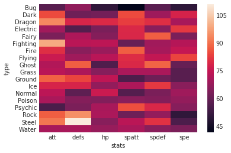
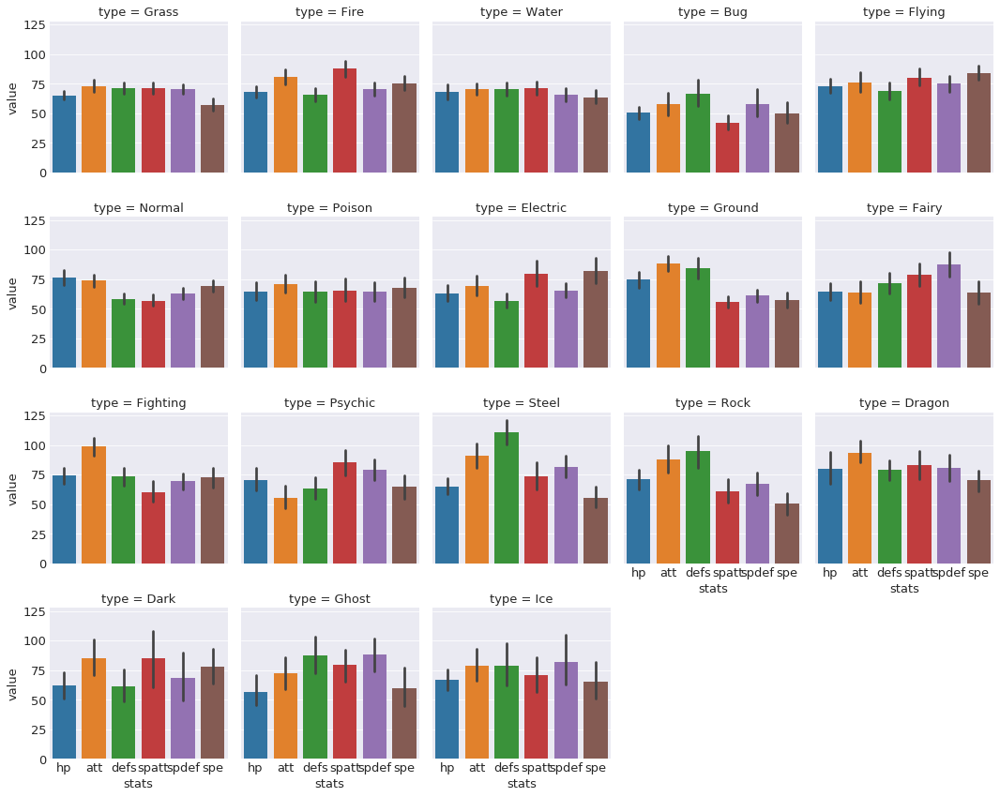
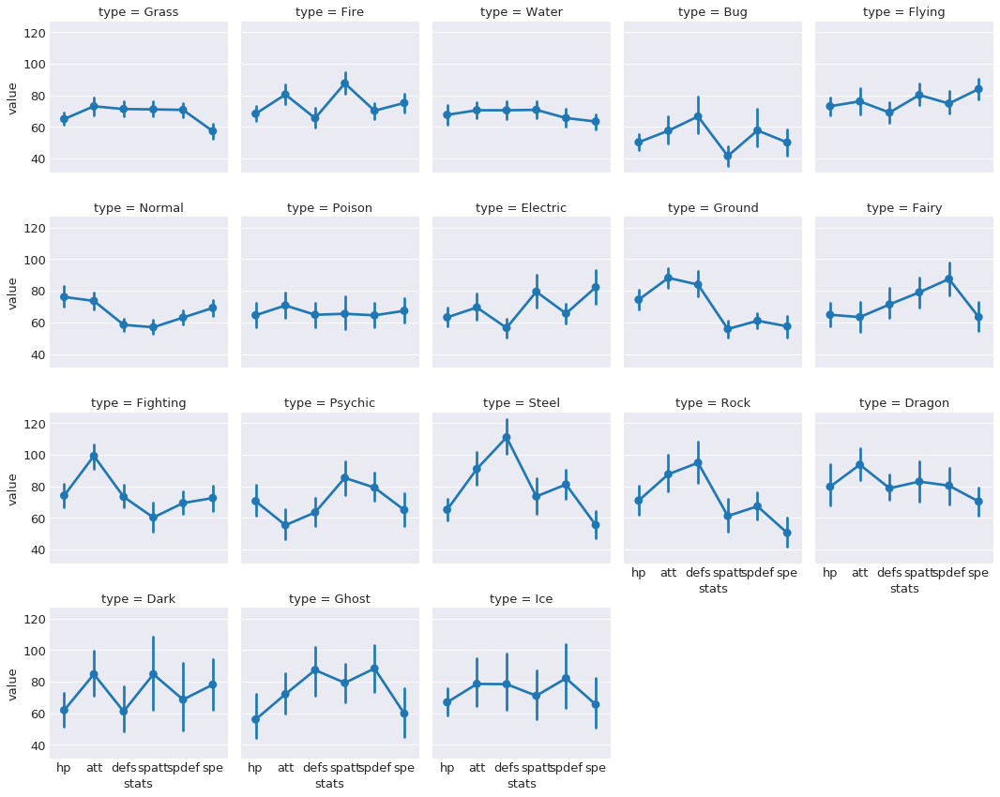

## Table of Contents

1. [Obtaining the Data](#obtaining-the-data)
2. [Exploratory Data Analysis](#exploratory-data-analysis)
3. [Obtaining Main Color of Pokemon](#obtaining-main-color-of-pokemon)
4. [Building a Predictive Model](#building-a-predictive-model)
5. [Conclusion](#Conclusion)

# Obtaining the Data

Before we can analyze data, we first need to obtain something to analyze. There are a lot of great websites that have the information we need, but for this example we'll be going with [Pokemon Database](https://www.pokemondb.net/pokedex/all). Instead of manually iterating through every single page writing down information about their battle stats, a much more efficient way would be to program a webscraper to automate the data collection. We'll be using Python's `resquest` module to send requests to the website and `BeautifulSoup` to parse the data. Let's begin. 


```python
# import modules for web scraping
import requests
from bs4 import BeautifulSoup
from tqdm import tqdm # add a progress bar for loops
```


```python
main_page = requests.get('https://pokemondb.net/pokedex/all')
soup = BeautifulSoup(main_page.content, 'html.parser')

poke_html_list = soup.select('a.ent-name')
poke_list = []
for poke in poke_html_list:
    if poke['href'] not in poke_list: poke_list.append(poke['href'])
```


```python
pokemon_list = []
base_stats = []
type_ = []
evo_stage_list = []

for pokemon in tqdm(poke_list):
    page2 = requests.get('https://pokemondb.net' + pokemon)
    soup2 = BeautifulSoup(page2.content, 'html.parser')
    
    stats = soup2.select('table.vitals-table tbody td.cell-num') #selecting all the numbers
    stat_numbers = []
    for index, i in enumerate(stats):
        if (index)%3 ==0: stat_numbers.append(i.text) #every 3 is one of the main stats
    base_stats.append(stat_numbers)
    
    
    types = soup2.select('table.vitals-table tbody tr a.type-icon')
    ind_type = []
    for i in types:
        ind_type.append(i.text)
    type_.append(list(set(ind_type)))

    evo_list = soup2.select('div.infocard a.ent-name')
    evo_list = list(map(str, evo_list))
    evo_stage = [stage for stage, item in enumerate(evo_list) if pokemon+'"' in item]
    # if the list is empty, then that means there is no other evolutions, so just assign it '1'
    try:
        evo_stage_list.append(evo_stage[0] + 1)
    except:
        evo_stage_list.append(1)
```


```python
hp = []
att = []
defs = []
spatt = []
spdef = []
spe = []

for i in base_stats:
    hp.append(i[0])
    att.append(i[1])
    defs.append(i[2])
    spatt.append(i[3])
    spdef.append(i[4])
    spe.append(i[5])
    
first_type = []
for i in type_:
    first_type.append(i[0])

import pandas as pd
dataf = pd.DataFrame({'pokemon': [i.replace('/pokedex/', '') for i in poke_list],
                      'hp': hp,
                      'att': att,
                      'defs': defs,
                      'spatt': spatt,
                      'spdef': spdef,
                      'spe': spe,
                      'type': first_type,
                      'types': type_,
                     'evo_stage': evo_stage_list})

dataf = dataf[['pokemon']+list(dataf.drop('pokemon', axis=1).columns)] # moving pokemon column to the front
dataf.to_csv('original_data.csv', index=False)
```

This program iterates through all of the individual pokemon's unique page and collects their HP, Attack, Defense, Sp. Attack, Sp. Def, Speed, Types, and their Evolution Stage. Once the information is collected, the data is passed into a pandas `DataFrame` object so we get an organized and informative dataframe! This is what the first 10 rows look like:


```python
dataf.head(10)
```

The data is formatted such that the columns represent the different stats, types, and evolution stage while each row represents a different pokemon. This convenient `DataFrame` structure will allow us easily perform our analyses. Now that the computer has done all the hard work of collecting the data, let's dive in!

# Exploratory Data Analysis


```python
# importing our data exploration modules
import pandas as pd
import numpy as np
import matplotlib.pyplot as plt
import seaborn as sns
%matplotlib inline
plt.rcParams.update({'font.size': 20}) # to increase matplotlib's font size
sns.set_style("darkgrid") # set plot styling
```

We'll be using `pandas` for all of our data manipulation needs. For visualizations, we'll be using `seaborn`, which is a statisical data visualization library that uses `matplotlib`. To pass the data into `seaborn`, we first need to "melt" the data so that it is in *long* format rather than *wide*. This means that there will be a single column called `stats` rather than having each stat as a separate column.


```python
dataf = pd.read_csv('original_data.csv')
dataf.loc[dataf.evo_stage>3, 'evo_stage'] = 3
dataf.pokemon = dataf.pokemon.str.lower()
dataf_stats = dataf.drop(['types'], axis=1)

dataf_long_stats = pd.melt(dataf_stats, id_vars = ['pokemon','type','evo_stage'], var_name = 'stats')
dataf_long_stats.head(10)
print('The shape of the original dataframe is: ', dataf.shape)
print('The shape of the melted dataframe is: ', dataf_long_stats.shape)
```


<div>
<style scoped>
    .dataframe tbody tr th:only-of-type {
        vertical-align: middle;
    }

    .dataframe tbody tr th {
        vertical-align: top;
    }

    .dataframe thead th {
        text-align: right;
    }
</style>
<table border="1" class="dataframe">
  <thead>
    <tr style="text-align: right;">
      <th></th>
      <th>pokemon</th>
      <th>type</th>
      <th>evo_stage</th>
      <th>stats</th>
      <th>value</th>
    </tr>
  </thead>
  <tbody>
    <tr>
      <th>0</th>
      <td>bulbasaur</td>
      <td>Grass</td>
      <td>1</td>
      <td>hp</td>
      <td>45</td>
    </tr>
    <tr>
      <th>1</th>
      <td>ivysaur</td>
      <td>Grass</td>
      <td>2</td>
      <td>hp</td>
      <td>60</td>
    </tr>
    <tr>
      <th>2</th>
      <td>venusaur</td>
      <td>Grass</td>
      <td>3</td>
      <td>hp</td>
      <td>80</td>
    </tr>
    <tr>
      <th>3</th>
      <td>charmander</td>
      <td>Fire</td>
      <td>1</td>
      <td>hp</td>
      <td>39</td>
    </tr>
    <tr>
      <th>4</th>
      <td>charmeleon</td>
      <td>Fire</td>
      <td>2</td>
      <td>hp</td>
      <td>58</td>
    </tr>
    <tr>
      <th>5</th>
      <td>charizard</td>
      <td>Fire</td>
      <td>3</td>
      <td>hp</td>
      <td>78</td>
    </tr>
    <tr>
      <th>6</th>
      <td>squirtle</td>
      <td>Water</td>
      <td>1</td>
      <td>hp</td>
      <td>44</td>
    </tr>
    <tr>
      <th>7</th>
      <td>wartortle</td>
      <td>Water</td>
      <td>2</td>
      <td>hp</td>
      <td>59</td>
    </tr>
    <tr>
      <th>8</th>
      <td>blastoise</td>
      <td>Water</td>
      <td>3</td>
      <td>hp</td>
      <td>79</td>
    </tr>
    <tr>
      <th>9</th>
      <td>caterpie</td>
      <td>Bug</td>
      <td>1</td>
      <td>hp</td>
      <td>45</td>
    </tr>
  </tbody>
</table>
</div>


    The shape of the original dataframe is:  (807, 10)
    The shape of the melted dataframe is:  (4842, 5)


We can see that the new dataframe is 807*6=4842. Instead of having a "wider" dataframe, the dataframe is now "longer," which makes it easier to perform aggregate computations and visualizations. First, let's see the average value of each stat using `pivot_table`.


```python
df_agg = dataf_long_stats.groupby('stats')
df_agg.value.agg([np.mean, np.std])
```


<div>
<style scoped>
    .dataframe tbody tr th:only-of-type {
        vertical-align: middle;
    }

    .dataframe tbody tr th {
        vertical-align: top;
    }

    .dataframe thead th {
        text-align: right;
    }
</style>
<table border="1" class="dataframe">
  <thead>
    <tr style="text-align: right;">
      <th></th>
      <th>mean</th>
      <th>std</th>
    </tr>
    <tr>
      <th>stats</th>
      <th></th>
      <th></th>
    </tr>
  </thead>
  <tbody>
    <tr>
      <th>att</th>
      <td>76.210657</td>
      <td>29.644590</td>
    </tr>
    <tr>
      <th>defs</th>
      <td>71.602230</td>
      <td>29.611741</td>
    </tr>
    <tr>
      <th>hp</th>
      <td>68.748451</td>
      <td>26.032808</td>
    </tr>
    <tr>
      <th>spatt</th>
      <td>69.610905</td>
      <td>29.567768</td>
    </tr>
    <tr>
      <th>spdef</th>
      <td>69.889715</td>
      <td>27.155402</td>
    </tr>
    <tr>
      <th>spe</th>
      <td>65.830235</td>
      <td>27.736838</td>
    </tr>
  </tbody>
</table>
</div>


Now, let's see the distributions of each stat with boxplots.


```python
plt.figure(figsize=(8,6))
sns.boxplot(x='stats', y='value', data = dataf_long_stats)
plt.title('Boxplot of Stats')
```


    <Figure size 576x432 with 0 Axes>


    <matplotlib.axes._subplots.AxesSubplot at 0x7fd02cd5f710>


    Text(0.5,1,'Boxplot of Stats')


Doesn't seem like there's anything *toooo* interesting here. The medians for each stat appears to be around 70-80. There does seem to be an abnormally large amount of outliers for HP. Let's take a look at how evolution stage affects stats using a swarmplot. Since the visual will be very messy with all the pokemon, I decided to take a look at the first 200.


```python
# script to extract first 200 pokemon
indexes = []
count = 0
for i in range(dataf_long_stats.shape[0]):
    if count <= 200:
        indexes.append(i)               
    count += 1               
    if i % 807 == 0:
        count = 0    
# drawing the swarmplot
plt.figure(figsize=(10,10))
sns.swarmplot(x='stats', y= 'value', hue = 'evo_stage', 
              data = dataf_long_stats.iloc[indexes], palette = 'muted' )
plt.title('Swarmplot of Stats with Evolution')
```


    <Figure size 720x720 with 0 Axes>


    <matplotlib.axes._subplots.AxesSubplot at 0x7fd02ac7fc88>


    Text(0.5,1,'Swarmplot of Stats with Evolution')


This graph tells us a few things that we probably already knew. First of all, we can see that the first stage comprises most of the pokemon and tends to have the lowest stats. Next, we see that the third stage are the fewest but they tend to be higher up on the graph. The second stage is intermediate in both count and stat values. 

Let's see what kind of role type plays on stats. First let's take a look at the numbers by aggregating the data with a pivot table.


```python
df_agg = pd.pivot_table(dataf_long_stats.drop('evo_stage',axis=1), 
                        index='type', columns = 'stats', values='value')
df_agg
sns.heatmap(df_agg)
```


<div>
<style scoped>
    .dataframe tbody tr th:only-of-type {
        vertical-align: middle;
    }

    .dataframe tbody tr th {
        vertical-align: top;
    }

    .dataframe thead th {
        text-align: right;
    }
</style>
<table border="1" class="dataframe">
  <thead>
    <tr style="text-align: right;">
      <th>stats</th>
      <th>att</th>
      <th>defs</th>
      <th>hp</th>
      <th>spatt</th>
      <th>spdef</th>
      <th>spe</th>
    </tr>
    <tr>
      <th>type</th>
      <th></th>
      <th></th>
      <th></th>
      <th></th>
      <th></th>
      <th></th>
    </tr>
  </thead>
  <tbody>
    <tr>
      <th>Bug</th>
      <td>57.575000</td>
      <td>66.625000</td>
      <td>50.275000</td>
      <td>41.575000</td>
      <td>57.750000</td>
      <td>50.150000</td>
    </tr>
    <tr>
      <th>Dark</th>
      <td>84.800000</td>
      <td>61.200000</td>
      <td>62.000000</td>
      <td>84.800000</td>
      <td>68.700000</td>
      <td>78.200000</td>
    </tr>
    <tr>
      <th>Dragon</th>
      <td>93.678571</td>
      <td>78.750000</td>
      <td>79.714286</td>
      <td>82.964286</td>
      <td>80.392857</td>
      <td>70.357143</td>
    </tr>
    <tr>
      <th>Electric</th>
      <td>69.454545</td>
      <td>56.515152</td>
      <td>63.181818</td>
      <td>79.424242</td>
      <td>65.606061</td>
      <td>82.242424</td>
    </tr>
    <tr>
      <th>Fairy</th>
      <td>63.333333</td>
      <td>71.361111</td>
      <td>64.833333</td>
      <td>79.000000</td>
      <td>87.500000</td>
      <td>63.361111</td>
    </tr>
    <tr>
      <th>Fighting</th>
      <td>99.227273</td>
      <td>73.318182</td>
      <td>74.113636</td>
      <td>60.227273</td>
      <td>69.386364</td>
      <td>72.568182</td>
    </tr>
    <tr>
      <th>Fire</th>
      <td>80.500000</td>
      <td>65.515625</td>
      <td>68.328125</td>
      <td>87.578125</td>
      <td>70.218750</td>
      <td>75.171875</td>
    </tr>
    <tr>
      <th>Flying</th>
      <td>76.157895</td>
      <td>69.070175</td>
      <td>73.087719</td>
      <td>80.210526</td>
      <td>74.789474</td>
      <td>83.982456</td>
    </tr>
    <tr>
      <th>Ghost</th>
      <td>72.142857</td>
      <td>87.428571</td>
      <td>56.142857</td>
      <td>79.285714</td>
      <td>88.428571</td>
      <td>59.857143</td>
    </tr>
    <tr>
      <th>Grass</th>
      <td>73.052632</td>
      <td>71.294737</td>
      <td>64.968421</td>
      <td>71.094737</td>
      <td>70.747368</td>
      <td>57.305263</td>
    </tr>
    <tr>
      <th>Ground</th>
      <td>88.166667</td>
      <td>83.900000</td>
      <td>74.366667</td>
      <td>55.783333</td>
      <td>61.033333</td>
      <td>57.500000</td>
    </tr>
    <tr>
      <th>Ice</th>
      <td>78.642857</td>
      <td>78.500000</td>
      <td>67.000000</td>
      <td>71.142857</td>
      <td>82.214286</td>
      <td>65.571429</td>
    </tr>
    <tr>
      <th>Normal</th>
      <td>73.588785</td>
      <td>58.457944</td>
      <td>76.093458</td>
      <td>56.906542</td>
      <td>63.028037</td>
      <td>69.177570</td>
    </tr>
    <tr>
      <th>Poison</th>
      <td>70.720000</td>
      <td>64.800000</td>
      <td>64.520000</td>
      <td>65.440000</td>
      <td>64.480000</td>
      <td>67.320000</td>
    </tr>
    <tr>
      <th>Psychic</th>
      <td>55.378378</td>
      <td>63.432432</td>
      <td>70.567568</td>
      <td>85.324324</td>
      <td>79.135135</td>
      <td>65.000000</td>
    </tr>
    <tr>
      <th>Rock</th>
      <td>87.629630</td>
      <td>94.888889</td>
      <td>70.925926</td>
      <td>61.185185</td>
      <td>67.333333</td>
      <td>50.481481</td>
    </tr>
    <tr>
      <th>Steel</th>
      <td>91.000000</td>
      <td>111.000000</td>
      <td>65.171429</td>
      <td>73.542857</td>
      <td>81.142857</td>
      <td>55.485714</td>
    </tr>
    <tr>
      <th>Water</th>
      <td>70.543210</td>
      <td>70.518519</td>
      <td>67.629630</td>
      <td>70.802469</td>
      <td>65.604938</td>
      <td>63.407407</td>
    </tr>
  </tbody>
</table>
</div>


    <matplotlib.axes._subplots.AxesSubplot at 0x7fd02ab131d0>





It's a bit hard to see any trends with just numbers and this heatmap... Let's see how these numbers play out with other visuals. This will be a barplot that describes the distribution of means for each of the stats.


```python
plt.rcParams.update({'font.size': 13})
g = sns.factorplot(x='stats', y = 'value', data = dataf_long_stats,
                   col = 'type', col_wrap=5, kind = 'bar', size = 3)
```





A bit hard to see, but there are some interesting trends. For example, bug type pokemon seem to have lower overall. Steel and rock types have strikingly high defense but very low speed. 


```python
plt.rcParams.update({'font.size': 13})
g = sns.factorplot(x='stats', y = 'value', data = dataf_long_stats,
                   col = 'type', col_wrap=5, kind = 'point', size = 3)
```





A similar visual, except using points rather than bar. This allows us to much more easily see the distribution of stats per type. Perhaps we can build a model that can learn these differences...

# Obtaining the Main Color of each Pokemon


```python
import requests
import PIL
import io
import numpy as np
import cv2
```


```python
# Download all of the pokemon images

poke_col_list = []
for counter, pokemon in enumerate(poke_list):
    page2 = requests.get('https://pokemondb.net' + pokemon)
    soup2 = BeautifulSoup(page2.content, 'html.parser')

    img_link = soup2.select('div.col.desk-span-4.lap-span-6.figure img')[0]['src']
    #print(img_link)
    

    img = requests.get(img_link, stream=True)
    
    img_name = 'images' + pokemon.replace('/pokedex', '') + '.jpg' 
    with open(img_name, 'wb') as handler:
        handler.write(img.content)
        #print('Saving', pokemon)
        print(str(counter+1)+ '/'+ str(len(poke_list)) + ' saved.')    
```

I will be defining the "main color" of the pokemon as the average of it's color. Each image contains the pokemon and a white background. If I take just the average of the entire image, it will be too white because of the white background. To avoid this problem, I used a k-means function to compute 2 clusters. One cluster center will correspond to the average of the white background while the other cluster center will correspond to the average of the pokemon color.


```python
from os import listdir
poke_img_files = listdir('images')

poke_col_list = []
for poke_img in tqdm(poke_img_files):
    img = PIL.Image.open('images/'+ poke_img)
    img = cv2.cvtColor(np.array(img), cv2.COLOR_RGB2BGR)

    Z = img.reshape((-1,3))
    # convert to np.float32
    Z = np.float32(Z)
    # define criteria, number of clusters(K) and apply kmeans()
    criteria = (cv2.TERM_CRITERIA_EPS + cv2.TERM_CRITERIA_MAX_ITER, 10, 1.0)
    K = 2
    ret,label,center=cv2.kmeans(Z,K,None,criteria,10,cv2.KMEANS_RANDOM_CENTERS)
    # Now convert back into uint8, and make original image
    center = np.uint8(center)
    res = center[label.flatten()]
    res2 = res.reshape((img.shape))


    b,g,r = cv2.split(res2)
    frame_rgb = cv2.merge((r,g,b))
    img_name = 'new_images/' + poke_img
    pil_img = PIL.Image.fromarray(frame_rgb, "RGB")
    pil_img.save(img_name)
    #print('Saving', poke_img)
    
    # extracting the two colors
    two_colors = []
    big_list = []
    res3 = res2.tolist()
    for i in res3:
        big_list.extend(i)
    for i in big_list:
        in_list = i in two_colors
        if in_list == False: two_colors.append(i)
    # the color that is farther away from 250 (white) is probably the pokemon's dominant color

    main_color = [sorted(two_colors)[0]] # each array is (BGR) instead of (RGB)
    poke_col_list.append(main_color)
```


```python
poke_col_list_flat = []
for i in poke_col_list:
    for j in i:
        poke_col_list_flat.append(j)
b, g, r = zip(*poke_col_list_flat) # create new lists that correspond to blue, green, and red channel
color_df = pd.DataFrame({'r':r, 'g': g, 'b': b,
                         'pokemon': [item.replace('.jpg', '') for item in poke_img_files]})

# adding this column 'color' because plotly requires color to be in that format
color_df['color'] = 'rgb(' + color_df.r.map(str) + ', ' + color_df.g.map(str) + ', ' + color_df.b.map(str) + ')'

dataf = pd.merge(dataf, color_df, on = 'pokemon') # merging the color dataframe with the original dataframe by 'pokemon' column
dataf.shape
dataf.head()

dataf.to_csv('data_w_color.csv', index= False)
```

Visualizing the the colors


```python
import plotly.plotly as py
import plotly.graph_objs as go
import numpy as np
```


```python
dataf = pd.read_csv('data_w_color.csv')

trace1 = go.Scatter3d(
    x=dataf['r'],
    y=dataf['g'],
    z=dataf['b'],
    mode='markers',
    marker=dict(
        color=dataf['color'],
        size=5,
        line=dict(
            color= dataf['color'],
            width=0.5
        ),
        opacity=0.8
    ),
    text = dataf.pokemon
)

data = [trace1]

layout = go.Layout(
    margin=dict(
        l=0,
        r=0,
        b=0,
        t=0
    ),
    scene = dict(
        xaxis = dict(title = 'Red'),
        yaxis = dict(title = 'Green'),
        zaxis = dict(title = 'Blue')
    ),
    paper_bgcolor='rgba(0,0,0,0)'
)
fig = go.Figure(data=data, layout=layout)
py.iplot(fig, filename='simple-3d-scatter')
```


<iframe id="igraph" scrolling="no" style="border:none;" seamless="seamless" src="https://plot.ly/~kennylov/61.embed" height="525px" width="100%"></iframe>


Interesting results... but this doesn't tell us much besides the color distribution. What's more important would be to include type into visual. Now, keeping the same points on this graph, but changing each point's color to correspond to its type. This will allow us to see the relationship between color and type. First, we need to create a new color scheme that corresponds to the colors that we're more familiar with.


```python
color_type_dict = {}

# obtaining this color palette from bulbapedia.com
color_type_dict = {'Grass': 'rgb(120,200,80)',
                   'Fire': 'rgb(240,128,48)',
                   'Water': 'rgb(104,144,240)',
                   'Bug': 'rgb(168,184,32)',
                   'Normal': 'rgb(168,168,120)',
                   'Poison': 'rgb(160,64,160)',
                   'Electric': 'rgb(248,208,48)',
                   'Ground': 'rgb(224,192,104)',
                   'Fairy': 'rgb(238,153,172)',
                   'Fighting': 'rgb(192,48,40)',
                   'Psychic': 'rgb(248,88,136)',
                   'Rock': 'rgb(184,160,56)',
                   'Ghost': 'rgb(112,88,152)',
                   'Ice': 'rgb(152,216,216)',
                   'Dragon': 'rgb(112,56,248)',
                   'Flying': 'rgb(168,144,240)',
                   'Dark': 'rgb(112,88,72)',
                   'Steel': 'rgb(184,184,208)'
}    

# mapping these colors to each pokemon    
color_type = []
for i in range(0,len(dataf)):
    p_type = dataf.iloc[i].type
    color_item = color_type_dict[p_type]
    col = color_item
    color_type.append(col)
    
dataf['color_type'] = color_type
```


```python
trace2 = []

for col_type in np.unique(color_type):
    dataf_type_subset = dataf.loc[dataf.color_type == col_type]
    trace2.append(
        go.Scatter3d(
        x=dataf_type_subset['r'],
        y=dataf_type_subset['b'],
        z=dataf_type_subset['g'],
        mode='markers',
        marker=dict(
            color=dataf_type_subset['color_type'],
            size=5,
            line=dict(
                color= dataf_type_subset['color_type'],
                width=0.5
            ),
            opacity=0.8
        ),
        text = dataf_type_subset['type'],
        name = dataf_type_subset.type.iloc[1]
        )
    )

    
data2 = [trace2]

layout = go.Layout(
    margin=dict(
        l=0,
        r=0,
        b=0,
        t=0
    ),
    scene = dict(
        xaxis = dict(title = 'Red'),
        yaxis = dict(title = 'Blue'),
        zaxis = dict(title = 'Green')
    ),
    paper_bgcolor='rgba(0,0,0,0)'
)

fig2 = go.Figure(data=trace2, layout=layout)
py.iplot(fig2, filename='simple-3d-scatter2')
```


<iframe id="igraph" scrolling="no" style="border:none;" seamless="seamless" src="https://plot.ly/~kennylov/63.embed" height="525px" width="100%"></iframe>


The pokemon are in the same space as the previous graph. The difference here is that the color of the points changed to represent the pokemon's type. Since there are so many different types in such a small plot, it's difficult to see clear clusters. However, there are distinct clusters; for example, you can see that fire types and water types are on opposite ends. Just out of curiousity I'll try different machine learning methods to see how useful of a feature color is.

# Building a Predictive Model

Just a reminder, we'll be trying to predict a pokemon's type by using their base stats, evolution stage, and color.
The first thing that should be done is to establish a benchmark to beat. This benchmark will be the accuracy of a "dumb" model that predicts only the most frequent type. Since the most frequent type is water, this "dumb" model will have an accuracy of about 116/807 $\approx$ 14%. 

Usually before feeding data into machine learning algorithms, the data must be preprocessed and formatted correctly to achieve the best results. However, it's a good thing that the data is already in the perfect format that we need, so no further preprocessing will be necessary. 

We'll split up the data into a training set (80%) and a validation set (20%) to see how well the model generalizes to data it hasn't seen before.


```python
from sklearn.linear_model import LogisticRegression
from sklearn.neighbors import KNeighborsClassifier
from sklearn.ensemble import RandomForestClassifier
from xgboost import XGBClassifier

from sklearn.model_selection import cross_val_score
from sklearn.metrics import accuracy_score
from sklearn.model_selection import train_test_split

from sklearn.model_selection import GridSearchCV

# xgboost causing warnings
import warnings
warnings.filterwarnings('ignore')
```


```python
dataf = pd.read_csv('data_w_color.csv')

# first drop all unnecessary variables
dataf_clean = dataf.drop(['types', 'color', 'pokemon'], axis=1)
X = dataf_clean.drop('type', axis=1) # feature matrix
y = dataf_clean.type # target vector
```


```python
# splitting the data into training and testing sets
X_train, X_test, y_train, y_test = train_test_split(X, y, test_size=0.2, random_state = 123, stratify = y)
print('The shape of X_train is ', X_train.shape)
print('The shape of y_train is ', y_train.shape)
print('The shape of X_test is ', X_test.shape)
print('The shape of y_test is ', y_test.shape)
```

    The shape of X_train is  (645, 10)
    The shape of y_train is  (645,)
    The shape of X_test is  (162, 10)
    The shape of y_test is  (162,)


Let's first try out a few classical machine learning algorithms to see which ones perform well by looking at their cross validation scores


```python
models = []
models.append(('LogisticRegression', LogisticRegression()))
models.append(("KNeighborsClassifier", KNeighborsClassifier(n_neighbors=10)))
models.append(("RandomForestClassifier", RandomForestClassifier(n_estimators=200,
                                                                criterion='gini',
                                                                    max_features=3)))
models.append(('XGBoost', XGBClassifier(learning_rate=0.05, n_estimators=100,
                                       max_depth= 5)))

results = []
names = []
for name,model in models:
    result = cross_val_score(model, X_train, y_train, cv=5)
    names.append(name)
    results.append(result)

mean_results = []
sd_results = []
for model in results:
    mean_results.append(model.mean())
    sd_results.append(model.std())

results_df = pd.DataFrame({'Model': names,
              'Mean Classification Rate': mean_results,
              'Standard Deviation': sd_results
             })
results_df.sort_values(by = 'Mean Classification Rate', ascending=False) # returning sorted dataframe
```


<div>
<style scoped>
    .dataframe tbody tr th:only-of-type {
        vertical-align: middle;
    }

    .dataframe tbody tr th {
        vertical-align: top;
    }

    .dataframe thead th {
        text-align: right;
    }
</style>
<table border="1" class="dataframe">
  <thead>
    <tr style="text-align: right;">
      <th></th>
      <th>Model</th>
      <th>Mean Classification Rate</th>
      <th>Standard Deviation</th>
    </tr>
  </thead>
  <tbody>
    <tr>
      <th>0</th>
      <td>LogisticRegression</td>
      <td>0.342986</td>
      <td>0.039329</td>
    </tr>
    <tr>
      <th>2</th>
      <td>RandomForestClassifier</td>
      <td>0.304093</td>
      <td>0.037466</td>
    </tr>
    <tr>
      <th>3</th>
      <td>XGBoost</td>
      <td>0.263581</td>
      <td>0.028925</td>
    </tr>
    <tr>
      <th>1</th>
      <td>KNeighborsClassifier</td>
      <td>0.254184</td>
      <td>0.033099</td>
    </tr>
  </tbody>
</table>
</div>


Seems that a simple logistic regression has the highest cross-validation score. Let's see how they do on the held-out validation set.


```python
results = []
names = []
for name, model in models:
    model_fit = model.fit(X_train, y_train)
    pred = model_fit.predict(X_test)
    result = accuracy_score(pred, y_test)
    results.append(result)
    names.append(name)

results_df = pd.DataFrame({
    'Model': names,
    'Classification Rate': results
})

results_df.sort_values(by = 'Classification Rate', ascending = False)
```


<div>
<style scoped>
    .dataframe tbody tr th:only-of-type {
        vertical-align: middle;
    }

    .dataframe tbody tr th {
        vertical-align: top;
    }

    .dataframe thead th {
        text-align: right;
    }
</style>
<table border="1" class="dataframe">
  <thead>
    <tr style="text-align: right;">
      <th></th>
      <th>Model</th>
      <th>Classification Rate</th>
    </tr>
  </thead>
  <tbody>
    <tr>
      <th>0</th>
      <td>LogisticRegression</td>
      <td>0.327160</td>
    </tr>
    <tr>
      <th>3</th>
      <td>XGBoost</td>
      <td>0.296296</td>
    </tr>
    <tr>
      <th>1</th>
      <td>KNeighborsClassifier</td>
      <td>0.290123</td>
    </tr>
    <tr>
      <th>2</th>
      <td>RandomForestClassifier</td>
      <td>0.283951</td>
    </tr>
  </tbody>
</table>
</div>


Indeed, logistic regression performs the best on the validation set. It is slightly lower than the training score, which is to be expected and suggests some overfitting. Now let's see how well neural networks perform on this dataset!


```python
from keras.models import Sequential
from keras.layers import Dense, Dropout
from keras.optimizers import Adam
from keras.wrappers.scikit_learn import KerasClassifier
from sklearn.cross_validation import cross_val_score
from sklearn.preprocessing import StandardScaler
import numpy as np

import keras.backend as K
```


```python
K.clear_session()

sc = StandardScaler()
X_train_sc = sc.fit_transform(X_train)
X_test_sc = sc.transform(X_test)


def build_nnet():
    nnet = Sequential()
    nnet.add(Dense(512, kernel_initializer= 'normal', input_shape = (10,), activation = 'relu'))
    nnet.add(Dropout(0.5))
    nnet.add(Dense(512, kernel_initializer= 'normal',activation = 'relu'))
    nnet.add(Dropout(0.3))


    nnet.add(Dense(18, activation = 'softmax'))
    nnet.compile(Adam(lr=0.001), 
                loss = 'categorical_crossentropy',
                metrics = ['accuracy'])
    return nnet

y_train_cat = pd.get_dummies(y_train)
y_test_cat = pd.get_dummies(y_test)
nnet = KerasClassifier(build_fn = build_nnet, epochs = 100, verbose =0)
```


```python
cv_score = cross_val_score(nnet, X_train, y_train_cat)
print('The cross-validation scores for this neural network are: ', cv_score)
print('The average cross-validation score for this neural network is: ', cv_score.mean())
```

    The cross-validation scores for this neural network are:  [0.31627907 0.31162791 0.3627907 ]
    The average cross-validation score for this neural network is:  0.3302325581395349


```python
nnet.fit(X_train, y_train_cat, epochs = 100, verbose=1, batch_size=100, validation_split = 0.2)

pred = nnet.predict(X_test)
#pred
accuracy_score(np.asarray(y_test_cat).argmax(axis=1),pred)
```

    Train on 516 samples, validate on 129 samples
    Epoch 1/100
    516/516 [==============================] - 0s 511us/step - loss: 13.7788 - acc: 0.0891 - val_loss: 13.3860 - val_acc: 0.1008
    Epoch 2/100
    516/516 [==============================] - 0s 63us/step - loss: 13.2896 - acc: 0.1240 - val_loss: 14.3508 - val_acc: 0.1085
    Epoch 3/100
    516/516 [==============================] - 0s 48us/step - loss: 13.7236 - acc: 0.1395 - val_loss: 14.3688 - val_acc: 0.1085
    Epoch 4/100
    516/516 [==============================] - 0s 57us/step - loss: 12.9963 - acc: 0.1609 - val_loss: 13.2170 - val_acc: 0.1473
    Epoch 5/100
    516/516 [==============================] - 0s 53us/step - loss: 13.5943 - acc: 0.1260 - val_loss: 13.1866 - val_acc: 0.1628
    Epoch 6/100
    516/516 [==============================] - 0s 56us/step - loss: 13.5122 - acc: 0.1376 - val_loss: 13.4828 - val_acc: 0.1395
    Epoch 7/100
    516/516 [==============================] - 0s 49us/step - loss: 13.2481 - acc: 0.1589 - val_loss: 13.2589 - val_acc: 0.1550
    Epoch 8/100
    516/516 [==============================] - 0s 36us/step - loss: 13.6526 - acc: 0.1395 - val_loss: 13.9917 - val_acc: 0.1318
    Epoch 9/100
    516/516 [==============================] - 0s 50us/step - loss: 13.5456 - acc: 0.1492 - val_loss: 13.5678 - val_acc: 0.1550
    Epoch 10/100
    516/516 [==============================] - 0s 42us/step - loss: 13.2826 - acc: 0.1609 - val_loss: 13.2928 - val_acc: 0.1628
    Epoch 11/100
    516/516 [==============================] - 0s 55us/step - loss: 13.4582 - acc: 0.1531 - val_loss: 13.7104 - val_acc: 0.1163
    Epoch 12/100
    516/516 [==============================] - 0s 36us/step - loss: 13.3496 - acc: 0.1609 - val_loss: 13.3531 - val_acc: 0.1550
    Epoch 13/100
    516/516 [==============================] - 0s 55us/step - loss: 13.3031 - acc: 0.1628 - val_loss: 13.2916 - val_acc: 0.1628
    Epoch 14/100
    516/516 [==============================] - 0s 46us/step - loss: 13.4970 - acc: 0.1531 - val_loss: 13.6056 - val_acc: 0.1318
    Epoch 15/100
    516/516 [==============================] - 0s 44us/step - loss: 13.3428 - acc: 0.1550 - val_loss: 13.1918 - val_acc: 0.1783
    Epoch 16/100
    516/516 [==============================] - 0s 63us/step - loss: 13.3160 - acc: 0.1647 - val_loss: 13.5650 - val_acc: 0.1473
    Epoch 17/100
    516/516 [==============================] - 0s 45us/step - loss: 13.2048 - acc: 0.1744 - val_loss: 13.3103 - val_acc: 0.1550
    Epoch 18/100
    516/516 [==============================] - 0s 45us/step - loss: 13.2929 - acc: 0.1628 - val_loss: 13.2591 - val_acc: 0.1550
    Epoch 19/100
    516/516 [==============================] - 0s 43us/step - loss: 13.3950 - acc: 0.1570 - val_loss: 13.6054 - val_acc: 0.1473
    Epoch 20/100
    516/516 [==============================] - 0s 52us/step - loss: 13.3247 - acc: 0.1609 - val_loss: 13.7293 - val_acc: 0.1395
    Epoch 21/100
    516/516 [==============================] - 0s 51us/step - loss: 13.3274 - acc: 0.1628 - val_loss: 13.3051 - val_acc: 0.1628
    Epoch 22/100
    516/516 [==============================] - 0s 53us/step - loss: 13.2103 - acc: 0.1628 - val_loss: 13.3252 - val_acc: 0.1550
    Epoch 23/100
    516/516 [==============================] - 0s 44us/step - loss: 13.3787 - acc: 0.1589 - val_loss: 13.3589 - val_acc: 0.1550
    Epoch 24/100
    516/516 [==============================] - 0s 48us/step - loss: 13.2508 - acc: 0.1705 - val_loss: 13.5455 - val_acc: 0.1473
    Epoch 25/100
    516/516 [==============================] - 0s 64us/step - loss: 13.2267 - acc: 0.1686 - val_loss: 13.0437 - val_acc: 0.1783
    Epoch 26/100
    516/516 [==============================] - 0s 41us/step - loss: 13.3481 - acc: 0.1609 - val_loss: 13.0437 - val_acc: 0.1783
    Epoch 27/100
    516/516 [==============================] - 0s 54us/step - loss: 13.2497 - acc: 0.1686 - val_loss: 13.5505 - val_acc: 0.1550
    Epoch 28/100
    516/516 [==============================] - 0s 45us/step - loss: 13.5157 - acc: 0.1531 - val_loss: 13.9940 - val_acc: 0.1318
    Epoch 29/100
    516/516 [==============================] - 0s 57us/step - loss: 13.4740 - acc: 0.1550 - val_loss: 13.1425 - val_acc: 0.1705
    Epoch 30/100
    516/516 [==============================] - 0s 46us/step - loss: 13.3608 - acc: 0.1628 - val_loss: 14.0275 - val_acc: 0.1240
    Epoch 31/100
    516/516 [==============================] - 0s 48us/step - loss: 13.7159 - acc: 0.1376 - val_loss: 13.9175 - val_acc: 0.1318
    Epoch 32/100
    516/516 [==============================] - 0s 47us/step - loss: 13.2729 - acc: 0.1589 - val_loss: 13.0739 - val_acc: 0.1705
    Epoch 33/100
    516/516 [==============================] - 0s 62us/step - loss: 12.5079 - acc: 0.1899 - val_loss: 14.1284 - val_acc: 0.1163
    Epoch 34/100
    516/516 [==============================] - 0s 46us/step - loss: 12.5269 - acc: 0.1996 - val_loss: 12.5212 - val_acc: 0.1783
    Epoch 35/100
    516/516 [==============================] - 0s 75us/step - loss: 12.5740 - acc: 0.1977 - val_loss: 11.8703 - val_acc: 0.2326
    Epoch 36/100
    516/516 [==============================] - 0s 37us/step - loss: 12.3452 - acc: 0.2054 - val_loss: 13.6100 - val_acc: 0.1395
    Epoch 37/100
    516/516 [==============================] - 0s 37us/step - loss: 12.5038 - acc: 0.2074 - val_loss: 12.1861 - val_acc: 0.2326
    Epoch 38/100
    516/516 [==============================] - 0s 41us/step - loss: 12.2124 - acc: 0.2151 - val_loss: 12.6450 - val_acc: 0.1783
    Epoch 39/100
    516/516 [==============================] - 0s 48us/step - loss: 12.3200 - acc: 0.2112 - val_loss: 11.8271 - val_acc: 0.2403
    Epoch 40/100
    516/516 [==============================] - 0s 45us/step - loss: 12.1141 - acc: 0.2093 - val_loss: 12.3372 - val_acc: 0.2171
    Epoch 41/100
    516/516 [==============================] - 0s 46us/step - loss: 12.5845 - acc: 0.2016 - val_loss: 13.0358 - val_acc: 0.1783
    Epoch 42/100
    516/516 [==============================] - 0s 68us/step - loss: 12.4286 - acc: 0.2151 - val_loss: 12.5184 - val_acc: 0.2171
    Epoch 43/100
    516/516 [==============================] - 0s 56us/step - loss: 12.4418 - acc: 0.2016 - val_loss: 12.8457 - val_acc: 0.1938
    Epoch 44/100
    516/516 [==============================] - 0s 45us/step - loss: 12.5496 - acc: 0.2035 - val_loss: 13.1120 - val_acc: 0.1783
    Epoch 45/100
    516/516 [==============================] - 0s 51us/step - loss: 12.3971 - acc: 0.2112 - val_loss: 11.9858 - val_acc: 0.2326
    Epoch 46/100
    516/516 [==============================] - 0s 57us/step - loss: 12.2584 - acc: 0.2209 - val_loss: 12.4260 - val_acc: 0.2016
    Epoch 47/100
    516/516 [==============================] - 0s 43us/step - loss: 11.8000 - acc: 0.2345 - val_loss: 11.6147 - val_acc: 0.2093
    Epoch 48/100
    516/516 [==============================] - 0s 60us/step - loss: 11.6209 - acc: 0.2287 - val_loss: 12.1742 - val_acc: 0.2171
    Epoch 49/100
    516/516 [==============================] - 0s 60us/step - loss: 11.8306 - acc: 0.2267 - val_loss: 11.6862 - val_acc: 0.2248
    Epoch 50/100
    516/516 [==============================] - 0s 42us/step - loss: 11.9488 - acc: 0.2248 - val_loss: 11.3431 - val_acc: 0.2326
    Epoch 51/100
    516/516 [==============================] - 0s 64us/step - loss: 11.7500 - acc: 0.2267 - val_loss: 10.3841 - val_acc: 0.2791
    Epoch 52/100
    516/516 [==============================] - 0s 54us/step - loss: 11.2017 - acc: 0.2287 - val_loss: 11.1441 - val_acc: 0.2171
    Epoch 53/100
    516/516 [==============================] - 0s 38us/step - loss: 12.1586 - acc: 0.1783 - val_loss: 10.3632 - val_acc: 0.2481
    Epoch 54/100
    516/516 [==============================] - 0s 55us/step - loss: 10.9653 - acc: 0.2442 - val_loss: 10.0784 - val_acc: 0.2636
    Epoch 55/100
    516/516 [==============================] - 0s 54us/step - loss: 11.3304 - acc: 0.2287 - val_loss: 10.7180 - val_acc: 0.2558
    Epoch 56/100
    516/516 [==============================] - 0s 52us/step - loss: 11.1120 - acc: 0.2345 - val_loss: 10.2268 - val_acc: 0.2403
    Epoch 57/100
    516/516 [==============================] - 0s 57us/step - loss: 10.8027 - acc: 0.2345 - val_loss: 10.0570 - val_acc: 0.2713
    Epoch 58/100
    516/516 [==============================] - 0s 62us/step - loss: 10.2866 - acc: 0.2616 - val_loss: 8.5595 - val_acc: 0.2636
    Epoch 59/100
    516/516 [==============================] - 0s 44us/step - loss: 9.7844 - acc: 0.2461 - val_loss: 7.5000 - val_acc: 0.2868
    Epoch 60/100
    516/516 [==============================] - 0s 55us/step - loss: 8.9532 - acc: 0.2364 - val_loss: 5.9934 - val_acc: 0.2558
    Epoch 61/100
    516/516 [==============================] - 0s 58us/step - loss: 7.3434 - acc: 0.2112 - val_loss: 4.3930 - val_acc: 0.2481
    Epoch 62/100
    516/516 [==============================] - 0s 40us/step - loss: 6.1514 - acc: 0.1609 - val_loss: 3.1188 - val_acc: 0.2403
    Epoch 63/100
    516/516 [==============================] - 0s 44us/step - loss: 4.3359 - acc: 0.2074 - val_loss: 2.5938 - val_acc: 0.2946
    Epoch 64/100
    516/516 [==============================] - 0s 45us/step - loss: 3.4070 - acc: 0.2481 - val_loss: 2.4392 - val_acc: 0.3101
    Epoch 65/100
    516/516 [==============================] - 0s 49us/step - loss: 3.0074 - acc: 0.2364 - val_loss: 2.4216 - val_acc: 0.3101
    Epoch 66/100
    516/516 [==============================] - 0s 52us/step - loss: 2.7628 - acc: 0.2287 - val_loss: 2.3957 - val_acc: 0.3256
    Epoch 67/100
    516/516 [==============================] - 0s 31us/step - loss: 2.6622 - acc: 0.2539 - val_loss: 2.3785 - val_acc: 0.3333
    Epoch 68/100
    516/516 [==============================] - 0s 33us/step - loss: 2.4993 - acc: 0.2829 - val_loss: 2.3324 - val_acc: 0.3178
    Epoch 69/100
    516/516 [==============================] - 0s 39us/step - loss: 2.4353 - acc: 0.3023 - val_loss: 2.2905 - val_acc: 0.3411
    Epoch 70/100
    516/516 [==============================] - 0s 35us/step - loss: 2.4459 - acc: 0.2829 - val_loss: 2.2826 - val_acc: 0.3256
    Epoch 71/100
    516/516 [==============================] - 0s 60us/step - loss: 2.4100 - acc: 0.2946 - val_loss: 2.3168 - val_acc: 0.3101
    Epoch 72/100
    516/516 [==============================] - 0s 47us/step - loss: 2.3816 - acc: 0.2907 - val_loss: 2.2977 - val_acc: 0.3178
    Epoch 73/100
    516/516 [==============================] - 0s 36us/step - loss: 2.3511 - acc: 0.3101 - val_loss: 2.3207 - val_acc: 0.3721
    Epoch 74/100
    516/516 [==============================] - 0s 38us/step - loss: 2.2593 - acc: 0.3256 - val_loss: 2.2824 - val_acc: 0.3488
    Epoch 75/100
    516/516 [==============================] - 0s 37us/step - loss: 2.3244 - acc: 0.3178 - val_loss: 2.2627 - val_acc: 0.3411
    Epoch 76/100
    516/516 [==============================] - 0s 44us/step - loss: 2.2409 - acc: 0.3140 - val_loss: 2.2587 - val_acc: 0.3411
    Epoch 77/100
    516/516 [==============================] - 0s 41us/step - loss: 2.2123 - acc: 0.3198 - val_loss: 2.2001 - val_acc: 0.3721
    Epoch 78/100
    516/516 [==============================] - 0s 39us/step - loss: 2.2075 - acc: 0.3062 - val_loss: 2.1789 - val_acc: 0.3566
    Epoch 79/100
    516/516 [==============================] - 0s 38us/step - loss: 2.2029 - acc: 0.3450 - val_loss: 2.2236 - val_acc: 0.3798
    Epoch 80/100
    516/516 [==============================] - 0s 43us/step - loss: 2.1674 - acc: 0.3178 - val_loss: 2.2822 - val_acc: 0.3953
    Epoch 81/100
    516/516 [==============================] - 0s 34us/step - loss: 2.1413 - acc: 0.3236 - val_loss: 2.2732 - val_acc: 0.4031
    Epoch 82/100
    516/516 [==============================] - 0s 33us/step - loss: 2.1398 - acc: 0.3411 - val_loss: 2.2515 - val_acc: 0.3876
    Epoch 83/100
    516/516 [==============================] - 0s 58us/step - loss: 2.0691 - acc: 0.3527 - val_loss: 2.2493 - val_acc: 0.3798
    Epoch 84/100
    516/516 [==============================] - 0s 47us/step - loss: 2.0179 - acc: 0.3372 - val_loss: 2.2402 - val_acc: 0.3566
    Epoch 85/100
    516/516 [==============================] - 0s 44us/step - loss: 2.0203 - acc: 0.3585 - val_loss: 2.2524 - val_acc: 0.3798
    Epoch 86/100
    516/516 [==============================] - 0s 48us/step - loss: 2.0425 - acc: 0.3605 - val_loss: 2.2723 - val_acc: 0.3643
    Epoch 87/100
    516/516 [==============================] - 0s 59us/step - loss: 2.0023 - acc: 0.3585 - val_loss: 2.2290 - val_acc: 0.3411
    Epoch 88/100
    516/516 [==============================] - 0s 33us/step - loss: 2.0118 - acc: 0.3798 - val_loss: 2.1902 - val_acc: 0.3411
    Epoch 89/100
    516/516 [==============================] - 0s 49us/step - loss: 2.0153 - acc: 0.3663 - val_loss: 2.2132 - val_acc: 0.3643
    Epoch 90/100
    516/516 [==============================] - 0s 41us/step - loss: 1.9754 - acc: 0.3876 - val_loss: 2.2372 - val_acc: 0.3643
    Epoch 91/100
    516/516 [==============================] - 0s 47us/step - loss: 2.0132 - acc: 0.3643 - val_loss: 2.2093 - val_acc: 0.3643
    Epoch 92/100
    516/516 [==============================] - 0s 42us/step - loss: 1.9766 - acc: 0.3643 - val_loss: 2.1890 - val_acc: 0.3721
    Epoch 93/100
    516/516 [==============================] - 0s 43us/step - loss: 1.9349 - acc: 0.3740 - val_loss: 2.1686 - val_acc: 0.3876
    Epoch 94/100
    516/516 [==============================] - 0s 47us/step - loss: 1.9494 - acc: 0.3895 - val_loss: 2.1857 - val_acc: 0.3953
    Epoch 95/100
    516/516 [==============================] - 0s 68us/step - loss: 1.9205 - acc: 0.3837 - val_loss: 2.1940 - val_acc: 0.3721
    Epoch 96/100
    516/516 [==============================] - 0s 58us/step - loss: 1.9373 - acc: 0.3953 - val_loss: 2.1727 - val_acc: 0.3876
    Epoch 97/100
    516/516 [==============================] - 0s 46us/step - loss: 1.8617 - acc: 0.4128 - val_loss: 2.1807 - val_acc: 0.3643
    Epoch 98/100
    516/516 [==============================] - 0s 49us/step - loss: 1.8325 - acc: 0.4302 - val_loss: 2.1890 - val_acc: 0.3643
    Epoch 99/100
    516/516 [==============================] - 0s 59us/step - loss: 1.8315 - acc: 0.4070 - val_loss: 2.1612 - val_acc: 0.3566
    Epoch 100/100
    516/516 [==============================] - 0s 75us/step - loss: 1.8302 - acc: 0.4186 - val_loss: 2.1932 - val_acc: 0.3178


    <keras.callbacks.History at 0x7fae7008afd0>


    0.35185185185185186


# Conclusion

Even though these models didn't yield world-class results, I still think it's quite an impressive improvement over the benchmark. It's highly likely that these variables aren't very good predictors for type. I did try running different models without the color features (not shown) and found that color improves the scores by about 5-10%, showing how important feature engineering is. There are a few things that likely could have improved the results. 
1. We could have collected more data on each pokemon, such as their height and weight, since certain types, such as steel and rock, are more heavier than others, such as grass and bug. 
2. We could have fine-tuned the algorithms' hyperparameters through methods such as random search or grid search.
3. 

Overall, from data collection to exploration to analysis, this was a challenging but fun little experiment for me to practice my data analysis and machine learning skills :).
